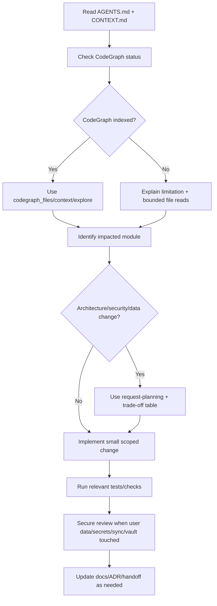

# Agent Operating Guide

This repository is a desktop-first, local-first personal learning knowledge app.
Every agent session must treat `CONTEXT.md` as the project memory and `plan.md`
as the execution plan. Do not infer a different product direction unless the
user explicitly changes it.

## Communication Standard

- Write as a senior software engineer with 10+ years of experience.
- When the user proposes an implementation method, analyze the implementation
  flow clearly before coding.
- Include a trade-off table covering scalability, maintainability, security,
  performance, and user experience for meaningful architecture or delivery
  decisions.
- Use Mermaid diagrams when a flow, state machine, sequence, or architecture is
  easier to reason about visually.
- Ask immediately when the requirement is ambiguous enough that a wrong
  assumption could change architecture, data safety, security, or UX.
- You may say no to a request when it violates the project constraints or
  introduces unacceptable risk.

## Required Startup Routine

1. Read this file.
2. Read `CONTEXT.md`.
3. Read relevant ADRs in `docs/adr/`.
4. Read `plan.md` only when planning sprint scope, backlog, team allocation, or
   acceptance gates.
5. Use CodeGraph before structural source exploration:
   - Run `codegraph_status` first.
   - Use `codegraph_files` for file structure when the index is populated.
   - Use `codegraph_context` for architecture, feature, and bug context.
   - Use `codegraph_explore` once when more source is needed.
   - Use native file reads only for literal text, docs, config files, or when
     CodeGraph is unavailable or empty.
6. If CodeGraph reports zero indexed files or "not initialized", do not pretend
   it has source context. Explain the limitation and either request indexing or
   fall back to narrow file reads.

Current bootstrap note: as of 2026-06-14, CodeGraph MCP has indexed the current
source files. The `.codegraph/` database is local generated state and must stay
out of git.

## Project Hard Rules

- Windows desktop is the source of truth.
- Flutter mobile is a companion for capture, review, and lightweight search.
- MVP supports PDF, text, Markdown, and image ingest only.
- Audio and video ingest are out of scope for MVP.
- FTS search must work before semantic search.
- Parser quality and source traceability are more important than flashy AI
  features.
- Do not add cloud sync, multi-user collaboration, full CRDT, or a plugin
  marketplace to the MVP.
- Do not make OpenClaw or third-party community skills part of the trusted core
  runtime. Treat them as inspiration or optional power-user experiments only.
- Keep the vault durable and human-auditable. The filesystem Markdown vault is
  canonical; SQLite/SQLCipher is an index and metadata store.

## Agent Skills

The local skill files live under `.agents/skills/<skill-name>/SKILL.md`. Before
using a skill, read its `SKILL.md` completely and follow its routing
instructions. If a skill references additional files, read only the relevant
referenced files.

### Issue Tracker

This repo has a GitHub remote for source pushes. Issue triage still uses local
markdown by default until the user explicitly asks to move issues to GitHub
Issues. See `docs/agents/issue-tracker.md`.

### Triage Labels

Use the default five-role triage vocabulary unless the user changes it. See
`docs/agents/triage-labels.md`.

### Domain Docs

This is a single-context repo: root `CONTEXT.md` plus ADRs under `docs/adr/`.
See `docs/agents/domain.md`.

## Skill Routing Table

| Situation | Required / Preferred Skill | Concrete Rule |
|---|---|---|
| New session, unfamiliar area, source analysis | `project-structure` | Read `CONTEXT.md`, inspect structure with CodeGraph first, then use bounded file reads. |
| User proposes architecture, DB, auth, sync, security, public UI, or risky implementation method | `request-planning` | Inspect context, list knowns/unknowns, present flow, trade-off table, acceptance criteria. |
| Meaningful backend/frontend/mobile implementation | `production-sdlc` | Apply SDLC gates, keep boundaries clear, update docs/ADRs when behavior changes. |
| Stack or convention decision | `tech-stack-rules` | Use only where it does not conflict with this repo's `CONTEXT.md`; this repo is not `ar-ai-exe`. |
| New feature with behavior changes | `test-strategy` | Define unit/integration/UI or golden tests proportional to risk. |
| User asks TDD, regression-first, or red-green-refactor | `tdd` | Write behavior tests through public interfaces before implementation. |
| Bug, failing behavior, crash, performance regression | `diagnose` | Reproduce, minimize, hypothesize, instrument, fix, regression-test. |
| Security, privacy, user data, vault, sync, auth, logs, config, or secrets | `secure-review` | Run before handoff; check secret handling, path safety, logging, and data exposure. |
| Refactor, architecture cleanup, module boundaries, testability | `improve-codebase-architecture` | Use domain language from `CONTEXT.md` and ADR decisions. |
| Need bigger-picture module map | `zoom-out` | Use after CodeGraph context when the area is still unclear. |
| Prototype a workflow, state machine, or UI option | `prototype` | Keep prototype disposable and explicit about the question being answered. |
| Convert plan/spec into PRD | `to-prd` | Use existing context; do not re-interview unless context is insufficient. |
| Convert PRD/plan into implementation tickets | `to-issues` | Use local markdown issue tracker by default. |
| Triage incoming issues | `triage` | Apply the five-role label vocabulary in `docs/agents/triage-labels.md`. |
| Handoff after non-trivial work | `session-handoff` | Summarize files changed, decisions, tests, risks, and next steps. |
| Compact context for another agent | `handoff` | Write the handoff outside the workspace unless the user asks otherwise. |
| Create or modify a skill | `write-a-skill` | Use progressive disclosure, clear triggers, and bundled references only when useful. |
| Exhaustive output explicitly requested | `full-output-enforcement` | No placeholders, no skipped sections, split output cleanly if needed. |
| User requests very terse mode | `caveman` | Compress wording while preserving technical accuracy. |

## Frontend and Visual Skill Routing

This product is an operational knowledge workstation, not a marketing site.
Default UI direction should be dense, calm, readable, and productivity-focused.

| Situation | Skill | Constraint |
|---|---|---|
| Product app screens, dashboards, workstation UI | `minimalist-ui` or local design rules | Prefer utilitarian layouts, compact controls, and clear information hierarchy. |
| Existing UI redesign | `redesign-existing-projects` | Audit first; do not break behavior. |
| Landing page, portfolio, or marketing site | `design-taste-frontend` | Only use for marketing surfaces, not the core app shell. |
| High-end visual direction requested | `high-end-visual-design` | Use only when the user explicitly wants premium visual exploration. |
| Industrial/data-heavy aesthetic requested | `industrial-brutalist-ui` | Use only when the user requests that direction. |
| Web design images before implementation | `imagegen-frontend-web` or `image-to-code` | Use only for visual comps where generated images are useful. |
| Mobile app screen concept images | `imagegen-frontend-mobile` | Use for Flutter companion visual concepts, not code. |
| Brand identity, logo, brand guidelines | `brandkit` | Use for brand system work only. |
| Google Stitch design system file | `stitch-design-taste` | Use only when creating Stitch-oriented `DESIGN.md`. |
| GSAP/Awwwards-style marketing motion | `gpt-taste` | Do not apply to the core workstation UI unless explicitly requested. |

## Implementation Flow

## Acceptance Criteria for Agent Work

- The change matches `CONTEXT.md` and does not expand MVP scope silently.
- Files changed are scoped to the requested module or documented bootstrap work.
- Tests or verification commands are run when toolchain exists.
- Security-sensitive changes get a `secure-review` pass.
- Docs/ADRs are updated when architecture, schema, sync, or security posture
  changes.
- Final response states what changed, what was verified, and what remains
  blocked.
