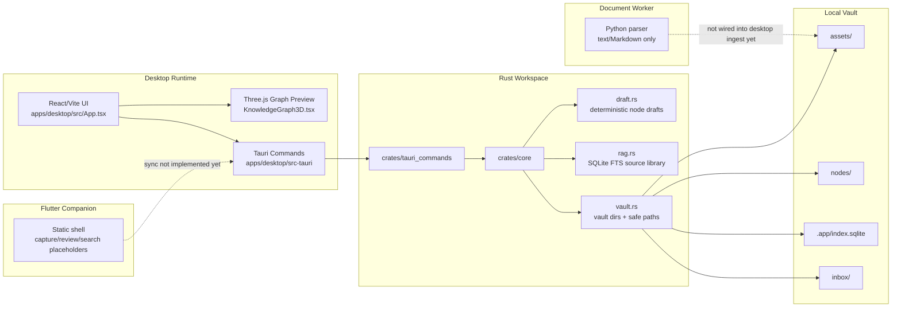
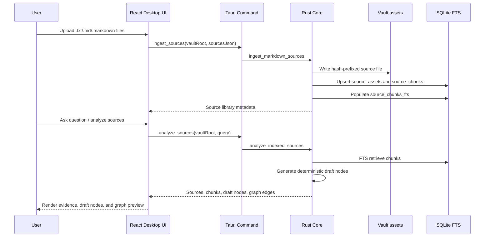

# Project Context

Last updated: 2026-06-30.

## Executive Summary

This repository is a desktop-first, local-first personal learning knowledge
app for Windows and macOS. The product goal is to help one user import learning
material, preserve source traceability, convert material into durable knowledge
nodes, search the local corpus, review knowledge over time, and inspect
relationships in a graph.

The current codebase is a Phase 1 vertical slice, not a finished MVP. It has a
working desktop web/Tauri shell, Rust core functions for deterministic draft
generation and local SQLite FTS source retrieval, a thin Tauri command bridge,
a Python text/Markdown document parser, and a static Flutter companion shell.

The important product rule remains:

> The vault is the product. SQLite is an index.

The current implementation partially honors that rule for uploaded text and
Markdown source assets, but generated knowledge nodes are not yet persisted as
canonical Markdown node files.

## Target User

The primary user is a single serious learner who studies technical, academic,
or professional material and wants private, durable, auditable knowledge
management on a Windows desktop.

Likely user profiles:

- A student or researcher importing PDFs, notes, Markdown, text, and images.
- A developer or professional building a private learning vault.
- A privacy-conscious user who wants offline access and no mandatory cloud
  backend.
- A power user who values source anchors, search, graph relationships, and
  review scheduling more than generic AI chat.

This is not a team collaboration product, public SaaS app, multi-tenant
knowledge base, or cloud-first AI assistant.

## Product Direction

| Area | Decision |
|---|---|
| Canonical platform | Windows and macOS desktop |
| Desktop shell | Tauri v2 with React/TypeScript |
| Core logic | Rust core crate |
| Mobile | Flutter companion only |
| Canonical data | Local filesystem vault with Markdown/source assets |
| Index | SQLite first, SQLCipher later when app-level encryption is needed |
| Search | SQLite FTS before semantic search |
| Document worker | Python/Rust worker outside the UI process |
| Graph UI | Roadmap-style 2.5D graph with approval sidebar |
| AI posture | Provider-based; deterministic retrieval must work without cloud |
| Sync posture | Desktop canonical; mobile pushes captures/review events later |

## Domain Language

**Project**:
A real ownership container with one stable ID. A Project owns Notes, Sources,
Concepts, Review Runs, and Learning Events; title and display slug may change
without changing its folder or identity.
_Avoid_: Notebook, workspace card, a view derived from a Note

**Project Manifest**:
The versioned `project.json` file inside a Project folder. It records Project
identity and display metadata, never secrets or canonical knowledge content.
_Avoid_: Project database row

**Note**:
User-authored canonical Markdown stored as `notes/<note_id>.md` inside one
Project. A Note is the default graph node and may have normalized tags.
_Avoid_: Learning note database row, generated node

**Source**:
An imported learning document owned by exactly one Project. Import creates a
managed snapshot so the Project remains usable if the external file moves.
_Avoid_: External path reference as the only copy

**Source Version**:
An immutable version of a Source snapshot. Evidence always references a
specific Source Version so later imports cannot silently change citations.

**Evidence Locator**:
A typed, checksummed location inside a Source Version: page and range for PDF,
line and character range for Markdown/text, or image region and OCR block for
images.
_Avoid_: Unanchored excerpt

**Concept**:
An AI-suggested knowledge unit that becomes canonical only after user approval,
then persists as `concepts/<concept_id>.md` with Evidence.
_Avoid_: Treating all AI output as a Note

**Review Run**:
An immutable Markdown review artifact scoped to a Project by default, with an
optional Note filter and recorded input versions.
_Avoid_: A single mutable review result

**Learning Event**:
A non-sensitive domain event such as `note_saved`, `review_completed`, or
`concept_approved`. Append-only events are the source for learning metrics;
SQLite summaries are rebuildable.
_Avoid_: Keystroke logging, raw-content telemetry

**PET**:
One vault-level companion whose deterministic state is derived from Learning
Events. It can offer project-aware action cards, but canonical writes and paid
AI calls require explicit user action.
_Avoid_: Autonomous owner of vault data

### Flagged ambiguities

- `Node` previously meant both a user Note and an AI-generated unit. Use
  **Note** for user-authored canonical knowledge and **Concept** for approved
  AI-derived knowledge. `Node` remains only a graph/rendering abstraction.
- `Project` previously meant a UI card derived from a Note. It now means the
  real ownership container defined above.

### Example dialogue

> Developer: “Which Project owns this Source Version?”
>
> Domain expert: “The Rust Project. Its Evidence Locator opens the cited PDF
> range, while the approved Concept links back to that Evidence.”
>
> Developer: “Can PET approve it automatically?”
>
> Domain expert: “No. PET may create an action card; the learner approves the
> Concept before it becomes canonical.”

## Project Vault Foundation

Implemented in `crates/core/src/project_vault.rs`.

- Creates real Project folders under `projects/<project_id>/` with versioned
  `project.json` metadata.
- Creates one canonical blank Markdown Note for every new Project and stores
  Notes as `notes/<note_id>.md` with YAML frontmatter.
- Keeps paths stable when titles change, normalizes tags, rejects unsafe IDs
  and managed-path symlinks, and writes through a temporary/backup swap.
- Exposes an explicit idempotent migration from SQLite `learning_notes` into
  the reserved `Imported` Project. It backs up SQLite and verifies migrated
  count/content hash before writing its completion marker.

The React UI still uses legacy Note commands until the next cutover slice.
Migration is therefore not yet invoked automatically by `initialize_vault`.
Existing global `assets/` and `nodes/` remain legacy-compatible until Sources
and approved Concepts move into Project folders.

## Future Product Direction: Manual-First Notes and PET/OpenClaw

The app direction is manual-first note-taking. Notes are the primary graph
nodes, and `[[wiki-link]]` style manual linking must remain useful without AI.
AI-generated concepts, links, review prompts, visualizations, and reading
resources are suggestions only and require user approval before changing
canonical vault data.

PET and OpenClaw are future companion/agent layers, not owners of canonical
data. PET should support care-oriented learning behavior in the app, and
OpenClaw may power advanced PET workflows such as visualization, study
coaching, and curated discovery. The local app remains the source of truth for
the vault, RAG index, note graph, citations, and review queue.

## Current Repository Layout

```txt
apps/
  desktop/                 # React/Vite desktop UI and Tauri app shell
    src/
      App.tsx              # Main product UI and browser/Tauri orchestration
      KnowledgeGraph3D.tsx # Legacy/experimental Three.js graph preview component
    src-tauri/             # Tauri v2 desktop runtime
  mobile_flutter/          # Flutter companion shell
crates/
  core/                    # Rust domain, vault, draft, and RAG logic
  tauri_commands/          # Thin command adapter over crates/core
workers/
  document_worker/         # Python text/Markdown parser and CLI
docs/
  adr/                     # Architectural decision records
  agents/                  # Agent operating conventions
  api-contract/            # Placeholder for command/sync contracts
  schema/                  # Placeholder for schema notes
  test-plan/               # Placeholder for test strategy details
scripts/
  dev/                     # Local helper scripts
tests/
  fixtures/
  golden/
  integration/
```

CodeGraph currently indexes the implemented source files across TypeScript,
Rust, Python, Dart, and YAML.

## Implemented Architecture



## Current Feature Set

### Desktop UI

Implemented in `apps/desktop/src/App.tsx`.

Current behavior:

- Three-page workspace: Note, Graph, and Review.
- Note page with source upload, note list, and slash-command editor.
- Settings surface with Account settings and provider-agnostic LLM
  Configuration (BYOK) controls.
- Source upload flow for `.txt`, `.md`, and `.markdown`.
- Upload limits in the UI: max 40 files per batch, max 2 MB per file.
- Source library rail showing indexed source count and chunk metrics.
- Review page with NotebookLM-style prompt, source count, citations, and study
  studio actions.
- Graph workspace using a roadmap-style 2.5D node map with a node detail
  sidebar and pending approval queue.
- Header actions keep LLM configuration and user account entry points separate
  from long-running Note, Graph, and Review workspaces.

The desktop UI now exposes Note, Graph, and Review workspaces. AI relation
suggestions are pending by default and require approve/reject decisions.
Generated canonical Markdown node persistence remains incomplete.

### 3D Knowledge Graph Preview

Implemented in `apps/desktop/src/KnowledgeGraph3D.tsx`.

Current behavior:

- Uses Three.js directly, not React Three Fiber.
- Renders graph nodes as instanced sphere meshes.
- Renders edges as line segments grouped by tone.
- Supports hover labels, anchored labels, pointer hit testing, and drag tilt.
- Respects reduced-motion preference by reducing animation behavior.
- Adds bundle weight: the current desktop build warns that the minified JS
  chunk is larger than 500 KB.

This is a preview/inspection surface, not a full graph editor yet.

### Rust Core Domain

Implemented in `crates/core/src/domain.rs`.

Domain structs exist for:

- Source assets.
- Source anchors.
- Nodes and node versions.
- Edges and edge kinds.
- Review items and review events.
- Review grades.

These types define the intended domain language, but not all of them are wired
into persistence or UI workflows yet.

### Vault Boundary

Implemented in `crates/core/src/vault.rs`.

Current behavior:

- Creates the vault directories:
  - `inbox/`
  - `assets/`
  - `nodes/`
  - `.app/`
- Uses `.app/index.sqlite` as the local SQLite index path.
- Provides safe relative path validation that rejects absolute paths, parent
  traversal, drive prefixes, and root prefixes.

Current limitation:

- The vault is not encrypted yet.
- `nodes/` is created, but generated node Markdown files are not written there.

### Deterministic Knowledge Drafts

Implemented in `crates/core/src/draft.rs`.

Current behavior:

- Generates local deterministic node drafts from a prompt or named source.
- Supports `.txt`, `.md`, and `.markdown` source names.
- Rejects empty prompts, unsupported source types, unsafe filenames, and
  prompts over 16,000 characters.
- Splits text into sentence-like units and groups into at most 4 draft nodes.
- Produces:
  - title
  - summary
  - tags
  - confidence score
  - relation type: Source, Prerequisite, Supports, Contrasts
  - source line range
  - simple graph edges
- Does not call any cloud model or local LLM.

This is useful as a deterministic vertical slice, but it is not semantic AI.

### Local Source Library and SQLite FTS

Implemented in `crates/core/src/rag.rs`.

Current behavior:

- Ingests batches of Markdown/text uploads.
- Rejects:
  - empty source batch
  - more than 40 sources per batch
  - empty source content
  - source content over 2 MB
  - unsafe source names
  - unsupported source extensions
- Normalizes line endings.
- Hashes source content with SHA-256.
- Writes source content into `vault/assets/` with a hash-prefixed filename.
- Creates/updates SQLite tables:
  - `source_assets`
  - `source_chunks`
  - `source_chunks_fts`
- Chunks content by headings, blank lines, and target length.
- Uses SQLite FTS5 with prefix terms for query matching.
- Falls back to latest chunks when a query has no usable FTS terms or no match.
- Analyzes retrieved chunks by passing top chunks into deterministic draft
  generation.

Current limitation:

- The schema is created inline, not through versioned migrations.
- The code stores source assets and chunks, not canonical generated node files.
- Search is lexical only; no embeddings or reranker are wired.

### Tauri Command Bridge

Implemented in `crates/tauri_commands/src/lib.rs` and
`apps/desktop/src-tauri/src/main.rs`.

Exposed commands:

- `initialize_vault`
- `generate_knowledge_draft`
- `generate_knowledge_draft_from_source`
- `ingest_sources`
- `analyze_sources`

The adapter is intentionally thin: it deserializes request data, calls the Rust
core, and serializes response DTOs as JSON strings for the UI.

### Browser Preview Fallback

Implemented in `apps/desktop/src/App.tsx`.

When the app runs in a normal Vite/browser session without Tauri internals:

- Uploaded sources are held in browser memory only.
- Source IDs use a simple JS stable hash, not SHA-256.
- Chunking and scoring are implemented in TypeScript.
- Drafts are generated by browser-side heuristics.

This is useful for frontend preview and development, but it is not durable and
must not be treated as the product data path.

### Python Document Worker

Implemented in `workers/document_worker/src/document_worker`.

Current behavior:

- CLI parses `.txt`, `.md`, and `.markdown`.
- Reads UTF-8 text with BOM handling.
- Preserves source asset metadata:
  - asset ID
  - SHA-256
  - filename
  - MIME type
  - modality
  - size
- Splits Markdown by headings and text by paragraphs.
- Produces source-anchored nodes with line offsets, section paths, stable node
  IDs, summaries, and node reasons.
- Has unit tests for Markdown heading parsing, plain text parsing, stable IDs,
  and unsupported suffix rejection.

Current limitation:

- PDF, image, and OCR parsing are not implemented.
- The worker is not yet wired into the desktop ingest path.

### Flutter Companion

Implemented in `apps/mobile_flutter/lib/main.dart`.

Current behavior:

- Static Material 3 app shell.
- Shows intended companion actions:
  - capture asset
  - review due cards
  - light search
  - local sync
- Pair desktop button exists visually but has no behavior.

Current limitation:

- No capture implementation.
- No local cache.
- No review flow.
- No pairing or sync protocol.
- No desktop communication.

## Current End-to-End Flow



## Constraints and Non-Goals

Hard constraints:

- Windows and macOS desktop apps are the source of truth.
- Flutter mobile is a companion, not the canonical vault.
- The filesystem Markdown vault is canonical; SQLite is rebuildable metadata
  and search index.
- Parser quality and source traceability are higher priority than flashy AI.
- FTS search must work before semantic search.
- Document conversion must preserve source anchors.
- Worker/converter code should run outside the UI process.
- No plaintext secrets in source, logs, or local config.
- Do not add cloud sync to the MVP.
- Do not add multi-user collaboration to the MVP.
- Do not add full CRDT to the MVP.
- Do not add audio/video ingest to the MVP.
- Do not add a plugin marketplace to the MVP.
- Do not make third-party community skills part of the trusted core runtime.

MVP target includes, but current code does not fully implement:

- PDF ingest.
- Image ingest and OCR.
- Local encrypted vault.
- SQLCipher metadata encryption.
- Graph editor MVP.
- Review queue and FSRS scheduling.
- Flutter capture/review/search implementation.
- Local desktop-to-mobile pairing and sync.
- Backup and index rebuild.

## Architecture Trade-Offs

| Decision | Scalability | Maintainability | Security | Performance | User Experience | Assessment |
|---|---|---|---|---|---|---|
| Desktop-first local vault | Good for personal 10k+ node scale; not meant for teams | Clear ownership if vault/index boundaries stay strict | Strong privacy posture, but app-level encryption is pending | Local I/O avoids network latency | Offline and durable for one user | Correct product direction |
| SQLite FTS before semantic search | Scales well for MVP corpus sizes | Much simpler than vector infra | No external data transfer | Fast lexical search target is realistic | Reliable exact/source search before AI | Correct sequencing |
| Deterministic drafts before LLM | Predictable and testable | Heuristics are simple but limited | No prompt leaves device | Very fast | Less intelligent than real summarization | Good Phase 1 slice, not final AI |
| Browser preview fallback | Not durable; does not scale as product path | Duplicates Rust logic and can drift | Keeps data in browser memory only | Fast for demos | Useful Vite preview without Tauri | Keep only as dev fallback |
| Three.js 3D graph preview | Instancing helps visual scale | Adds UI complexity and bundle size | Low direct security risk | Current build has >500 KB chunk warning | Rich visual feedback, but not editor yet | Acceptable if kept secondary to workflow |
| Inline SQLite schema creation | Fine for prototype | Will become hard to evolve | No migration audit trail yet | Simple startup | Invisible to user | Replace with migrations before MVP |

## Known Gaps

| Gap | Why It Matters | Likely Next Step |
|---|---|---|
| Generated nodes are not written to `vault/nodes/` | Violates the long-term "vault is product" model if left unresolved | Add canonical Markdown node persistence with source anchors |
| API key persistence is session-only in the current UI | Production AI provider use needs secure OS-backed storage | Wire Tauri Stronghold or OS secure storage before saving keys |
| Python worker is not wired into desktop ingest | Desktop ingest currently handles text/Markdown only in Rust | Define worker boundary and call it from ingest pipeline |
| PDF/image/OCR missing | MVP explicitly includes PDF and image ingest | Add parser fixtures and golden tests before implementation |
| SQLCipher/encrypted vault missing | Security posture is local-first but not app-encrypted yet | Decide encryption boundary and key storage ADR |
| Review scheduler not implemented | Review is part of product promise | Implement FSRS/basic scheduling after node persistence |
| Mobile app is static | Companion workflow is not functional | Formalize sync contract, then implement pairing/capture |
| Schema/API docs are placeholders | Hard to coordinate future work safely | Fill `docs/schema` and `docs/api-contract` from implemented contracts |
| Frontend lacks automated tests | UI regressions are likely as workflow grows | Add component/e2e smoke tests for upload/analyze flows |
| Browser fallback duplicates core behavior | Drift risk between preview and real runtime | Keep fallback small or generate shared fixtures/contracts |

## Verification Snapshot

Verified on 2026-06-21:

| Command | Result |
|---|---|
| `cargo test` | Pass: 12 core tests, 3 Tauri command tests |
| `powershell -ExecutionPolicy Bypass -File scripts/dev/test-worker.ps1` | Pass: 4 Python worker tests |
| `powershell -ExecutionPolicy Bypass -File scripts/dev/desktop-build.ps1` | Pass; Vite warns one JS chunk is larger than 500 KB |
| `cargo check` in `apps/desktop/src-tauri` | Pass |

Flutter was not re-verified in this pass.

## Recommended Next Implementation Order

1. Persist accepted draft nodes into `vault/nodes/` as Markdown with source
   anchors and rebuildable metadata.
2. Replace inline SQLite schema setup with versioned migrations.
3. Wire the document worker into desktop ingest for text/Markdown first, then
   extend with PDF/image/OCR using golden fixtures.
4. Formalize command contracts in `docs/api-contract`.
5. Document actual SQLite schema in `docs/schema`.
6. Add frontend smoke tests for upload, analyze, evidence display, and graph
   update.
7. Implement review item generation and basic scheduling after nodes are
   persisted.
8. Design local mobile pairing/sync only after desktop canonical data is stable.

## Source of Truth for Future Agents

When working in this repository:

- Read `AGENTS.md` first.
- Read this `CONTEXT.md` before changing product behavior.
- Read ADRs under `docs/adr/`.
- Use CodeGraph for structural code exploration.
- Treat current source code as Phase 1, not as a complete MVP.
- Do not silently expand scope beyond the constraints above.
