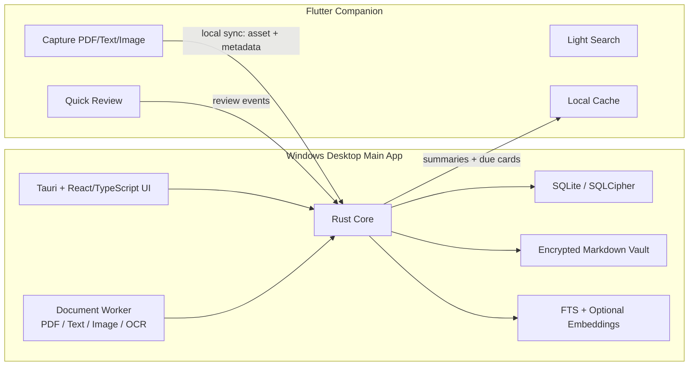
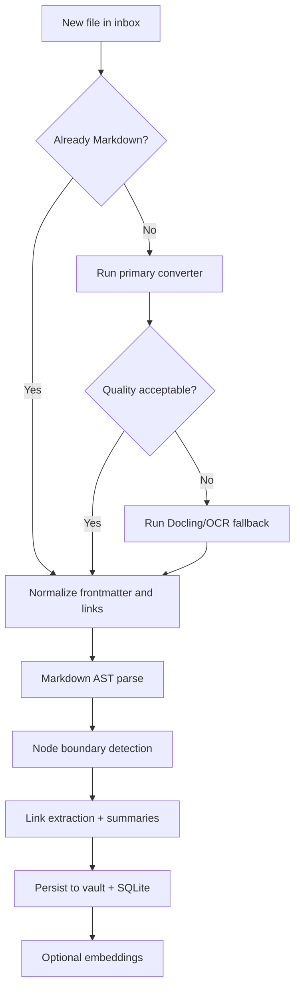
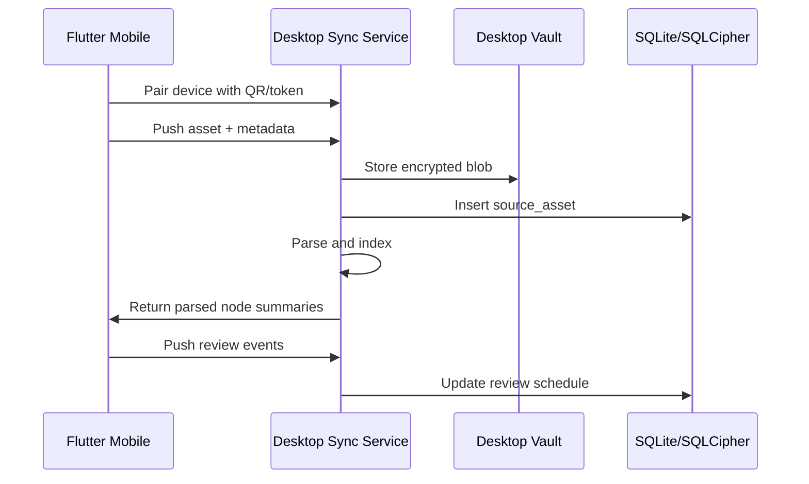

# Project Context

Last updated: 2026-06-14.

## Product Summary

This project is a private, local-first knowledge graph desktop app for personal
learning. The app helps a single user import learning material, convert it into
traceable Markdown-backed knowledge nodes, search and review those nodes, and
understand relationships through a graph.

The product is intentionally desktop-first. Windows desktop is the primary app
and source of truth. Flutter mobile is a companion for capture, quick review,
and lightweight search, not the canonical data store.

Primary source docs:

- `idea.md`: research, architecture options, trade-offs, risks, and product
  recommendation.
- `plan.md`: six-month SDLC implementation plan, sprint breakdown, MoSCoW
  backlog, gates, test plan, and target repo structure.

## Final Direction

| Area | Decision |
|---|---|
| Desktop shell | Tauri v2 with React/TypeScript UI |
| Core system | Rust core |
| Mobile | Flutter companion app |
| Local database | SQLite first, SQLCipher for encrypted production metadata |
| Canonical data | Encrypted filesystem vault with Markdown nodes and assets |
| Parser worker | Python/Rust document worker for PDF/text/image/OCR |
| Graph UI | React Flow for MVP graph interactions |
| Search | SQLite FTS first, semantic search second |
| Review scheduler | FSRS basic |
| Sync | Desktop-canonical local sync with mobile companion |
| AI | Local-first; generation is optional, retrieval must work without cloud |

## Scope

### MVP Includes

- Windows desktop app.
- Local encrypted vault.
- Import PDF, text, Markdown, and image.
- Basic image OCR.
- Node generation with source anchors.
- SQLite/SQLCipher metadata and search index.
- FTS search.
- Basic semantic search after FTS works.
- Graph viewer/editor MVP.
- Review queue and FSRS basic scheduling.
- Flutter mobile capture, review, and lightweight search.
- Local desktop-to-mobile pairing/sync.
- Backup and index rebuild.

### MVP Excludes

- Audio/video ingest.
- Cloud sync.
- Multi-user collaboration.
- Full CRDT.
- Full mobile graph editor.
- Firecracker/gVisor sandbox.
- Plugin marketplace.
- Server-first LLM architecture.

## Architecture



## Repository Layout

The target monorepo layout follows `plan.md`:

```txt
apps/
  desktop/            # Tauri + React/TypeScript UI
  mobile_flutter/     # Flutter companion app
crates/
  core/               # Rust domain core: vault, storage, graph, search, review, sync, crypto
  tauri_commands/     # Tauri command bridge over the core crate
workers/
  document_worker/    # Document conversion, OCR, segmentation, embeddings
docs/
  adr/                # Architectural decision records
  agents/             # Agent issue/triage/domain conventions
  architecture/       # Architecture notes and diagrams
  api-contract/       # Desktop/mobile sync and command contracts
  schema/             # SQLite/schema documentation
  test-plan/          # Test strategy and acceptance gates
  release/            # Packaging and release notes
tests/
  fixtures/           # PDF/text/image fixtures
  golden/             # Parser golden outputs
  integration/        # Import -> parse -> search -> review tests
scripts/
  dev/
  build/
  benchmark/
```

## Domain Language

Use these terms consistently in code, docs, issues, and reviews:

| Term | Meaning |
|---|---|
| Vault | Canonical local storage root containing assets, Markdown nodes, manifests, and app metadata. |
| Source asset | Original imported file with hash, MIME type, provenance, and storage path. |
| Node | A durable learning unit generated from source material. |
| Node version | Versioned content body for a node; preserves edit and parser history. |
| Source anchor | Trace from a node back to source file, page, heading, offset, or image region. |
| Edge | Typed graph relation between nodes, such as parent/child, next, same-source, mentions, semantic-near, prerequisite. |
| Review item | A schedulable prompt/card derived from a node. |
| Review event | A user review action with grade, latency, timestamp, and device ID. |
| Inbox | Quarantined import area before conversion and indexing. |
| Index | Rebuildable SQLite/FTS/vector metadata derived from vault content. |
| Pairing token | Short-lived token for local mobile-to-desktop pairing. |
| Device allowlist | Local list of paired companion devices. |

## Data Ownership Rule

The vault is the product. The database is an index.

Implications:

- Raw source assets must be hash-addressed or otherwise traceable.
- Generated nodes must preserve source anchors.
- SQLite/SQLCipher data must be rebuildable from vault contents where feasible.
- Never store irreplaceable user knowledge only in a transient cache.
- No plaintext secrets in source files, logs, or local config.

## Ingestion Pipeline



Node splitting starts deterministic and traceable:

- Split by headings, list roots, theorem/example blocks, quote/code fences, and
  PDF page boundaries.
- Aim for 150-400 tokens per node, with a hard max near 700 except atomic
  tables/formulas.
- Use semantic checks to merge or split only after structural parsing.
- Treat LLMs as post-processors, not as the source of truth for boundaries.

## Retrieval Pipeline

Recommended retrieval order:

1. SQLite FTS over titles, headings, summaries, aliases, formulas, and concepts.
2. One-hop graph expansion through parent/child, prerequisite, next, and
   same-source edges.
3. Optional semantic search only when lexical confidence is low.
4. Optional reranking.
5. Answer synthesis using cited node snippets and graph/source paths.

Do not introduce Qdrant, Weaviate, or another vector service in MVP unless
SQLite-based retrieval clearly fails in measured tests.

## Sync Model

Desktop is canonical. Mobile can push assets and review events, then receive
parsed summaries, due cards, and lightweight cache updates.



Security defaults:

- Local HTTPS only.
- Short-lived pairing token.
- Device allowlist.
- Uploads only to the vault inbox.
- Quarantine before conversion.
- Audit original filename, SHA-256, device ID, timestamp, and conversion status.

## Security Posture

- Prefer OS whole-disk encryption as baseline.
- Store app secrets in OS secure storage: DPAPI on Windows, Keychain on macOS.
- Use SQLCipher when app-level encrypted metadata is required.
- Converters and OCR must run outside the UI process.
- Do not inherit host environment secrets into workers or experiment runners.
- Sandbox experiments must deny network by default, mount vault data read-only,
  enforce CPU/RAM/disk/time quotas, and write only to an approved workspace.

## SDLC Gates

| Gate | Required Outcome |
|---|---|
| Planning | Scope, non-goals, ADRs, schema v1, sync contract, test strategy, and risk register are approved. |
| Technical feasibility | Tauri shell, Flutter shell, Rust bridge, SQLite migration, import, parser baseline, and CI build run. |
| Alpha | 50 imports without crash, correct source search, visible source anchors, usable 200-node graph, mobile capture, backup rebuild. |
| MVP release | Clean Windows install, zero critical/high bugs, 10k-node lexical search under 300-500ms, startup under 3s, no plaintext vault content. |

## Test Strategy

Use coverage proportional to risk:

- Unit tests: hashing, vault paths, encryption boundaries, schema, review
  scheduler.
- Integration tests: import -> parse -> node -> search.
- Golden tests: PDF/text/image parser outputs and source anchors.
- Sync tests: offline, retry, duplicate asset, missing blob.
- Security tests: wrong key, corrupted DB, denied file access, secret leakage.
- Performance tests: 100 files, 10k nodes, search latency, parser background
  behavior.

## Current Bootstrap State

As of 2026-06-14:

- The workspace has `idea.md`, `plan.md`, `.agents/skills`, and `.codegraph`.
- The folder is a git repository on branch `main` with remote
  `https://github.com/kiet-ta/personal-learning.git`.
- `AGENTS.md`, `CONTEXT.md`, `docs/agents/*`, and the Phase 0 docs scaffold
  were added to establish agent and project context.
- Phase 1 code skeleton exists for the document worker, Rust core boundary,
  desktop shell, Tauri command adapter, and Flutter companion shell.
- The document worker implements text/Markdown parsing into source-anchored
  nodes with unit tests.
- CodeGraph MCP is available and has indexed the source files generated during
  Phase 1.
- Node.js, npm, Flutter, Python, Rust, and Cargo are available, but the npm
  PowerShell shim points at a broken Roaming profile. Use the scripts under
  `scripts/dev/` until the global npm shim is repaired.
- Rust core tests pass. Tauri dependency compilation is currently blocked by a
  Windows Application Control policy when dependency build scripts execute.
- Desktop web build passes and can be served locally with Vite.
- Flutter `pub get`, `doctor`, and `analyze` currently time out in this
  environment before diagnostics are produced.
- `.gitignore` excludes generated local state such as `.codegraph/`,
  `node_modules/`, `target/`, `dist/`, `.dart_tool/`, logs, env files, and local
  vault databases. Commit `Cargo.lock` and `package-lock.json` for reproducible
  app builds.

## Next Implementation Order

1. Initialize git and CI conventions.
2. Install/confirm Rust, Cargo, Python, Node, npm, Flutter, and Tauri tooling.
3. Scaffold Tauri desktop shell and Flutter mobile shell.
4. Create Rust core crate with vault and SQLite migration boundary.
5. Implement import to inbox with hashing.
6. Add document worker baseline for text/Markdown first, then PDF/image.
7. Add source-anchored node model.
8. Add FTS search before semantic search.
9. Add graph MVP and review engine.
10. Add local mobile pairing/sync.
