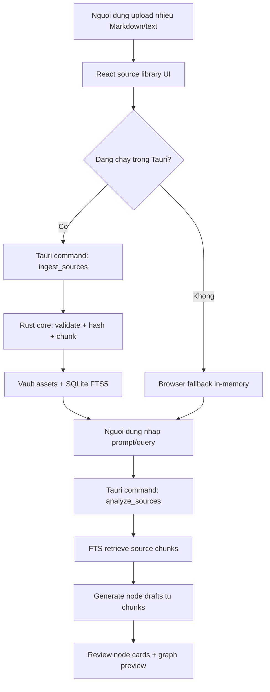
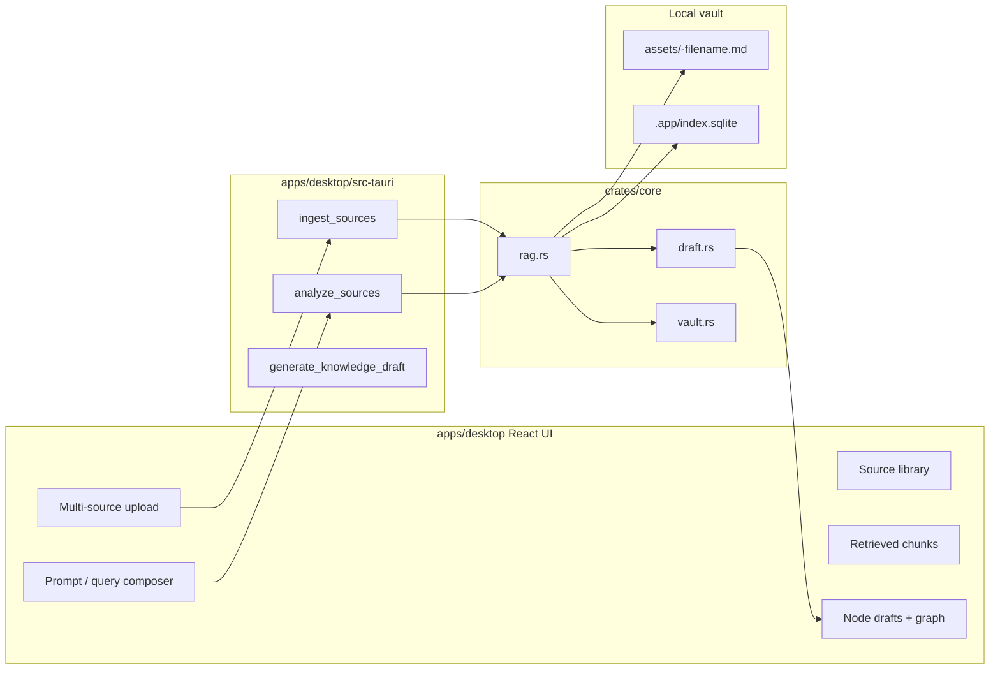
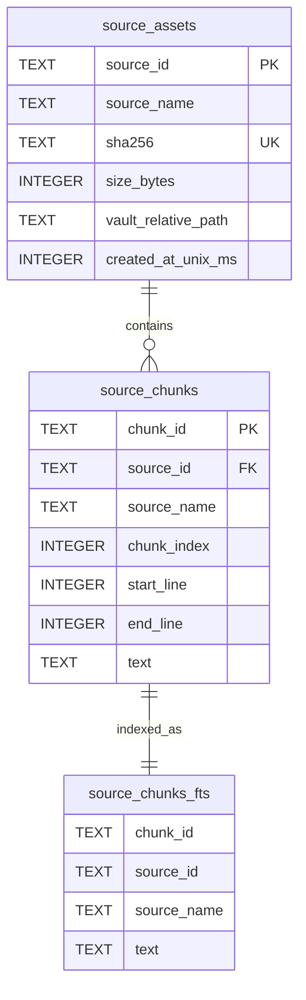
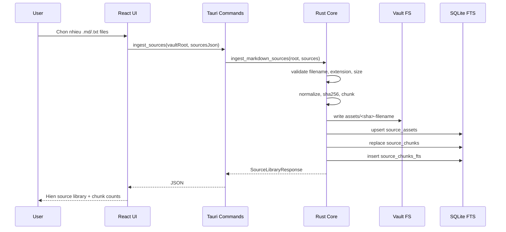
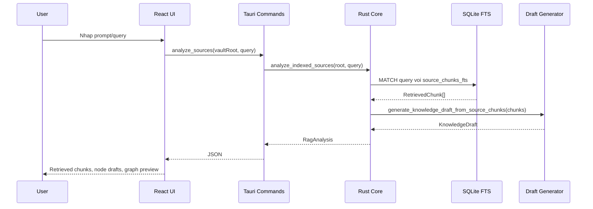
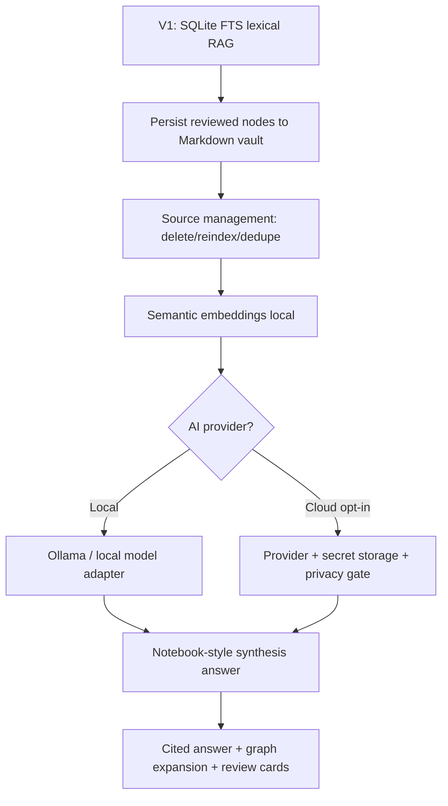

# NotebookLM-style Local RAG Review

Last updated: 2026-06-14

## Muc tieu

Tai lieu nay tom tat phien ban v1 cua luong NotebookLM-style cho ung dung
Learn Alone: nguoi dung co the upload nhieu file Markdown/text, dua chung vao
vault local, index bang SQLite FTS5, truy van theo prompt, va tao node draft tu
cac source chunk duoc retrieve.

Muc tieu v1 khong phai la clone day du NotebookLM. Muc tieu la tao nen tang
local-first co trace source ro rang, de sau nay co the them AI/embedding ma
khong pha vo data model.

## Trang thai hien tai

| Hang muc | Trang thai |
|---|---|
| Multi-file upload | Da co: `.md`, `.markdown`, `.txt`, toi da 40 file/batch |
| Gioi han file | 2 MB/file trong UI v1 |
| Vault assets | Da ghi source vao `vault/assets/` |
| SQLite metadata | Da co `source_assets`, `source_chunks` |
| FTS index | Da co `source_chunks_fts` bang SQLite FTS5 |
| Query/analyze | Da retrieve chunks bang FTS va tao node drafts |
| Source anchor | Da giu anchor dang `filename.md:start-end` |
| LLM/AI provider | Chua co |
| Embedding/vector search | Chua co |
| Persist final Markdown nodes | Chua co |
| PDF/image/audio/video | Chua nam trong slice nay |

## Luong nguoi dung

## Kien truc hien tai

## SQLite schema v1

Ghi chu:

- `source_assets` giu metadata file goc.
- `source_chunks` giu chunk co line anchor.
- `source_chunks_fts` la virtual table FTS5 de retrieve lexical.
- SQLite la index rebuildable; vault assets van la source local de audit.

## Sequence ingest

## Sequence analyze

## Trade-off hien tai

| Lua chon | Scalability | Maintainability | Security | Performance | User experience |
|---|---|---|---|---|---|
| SQLite FTS5 truoc embeddings | Tot cho MVP, du voi 10k-100k chunks local | Don gian, it moving parts | Local-only, khong gui data ra ngoai | Nhanh, deterministic | Ket qua lexical, co the miss synonym |
| Vault assets + SQLite index | Tot vi index rebuildable | Ro ownership: vault la source of truth | De audit, de backup | Ghi/read local nhanh | Can UI quan ly reindex/delete sau |
| JSON string qua Tauri command | Du dung cho v1 | De debug, khong can phu thuoc TS codegen | Khong them attack surface lon | Payload lon can canh chung | UI wire nhanh |
| Browser fallback in-memory | Tot cho dev/test Vite | Tach ro runtime Tauri vs browser | Khong ghi disk khi browser | Nhanh voi file nho | Data mat khi reload |
| Chua them LLM | Giam complexity | Data model on dinh truoc | Tranh leak source | Khong phu thuoc network | Chua thong minh nhu NotebookLM |

## Gioi han can review

1. Chua co AI provider:
   - Node draft hien la deterministic tu retrieved chunks.
   - Muon giong NotebookLM hon thi can local LLM hoac cloud opt-in.

2. Chua co semantic search:
   - FTS phu thuoc lexical match.
   - Query synonym/cau hoi mo co the retrieve kem.

3. Chua persist final nodes:
   - Draft cards va graph preview chua ghi thanh Markdown nodes trong vault.

4. Chua co source management:
   - Chua co delete/reindex source UI.
   - Chua co duplicate handling UI, du core upsert theo hash.

5. Chua co encryption app-level:
   - Vault local hien nam trong thu muc user chon.
   - SQLCipher/encrypted vault la buoc sau.

6. Chua xu ly PDF/image:
   - Slice nay chi tap trung `.md`, `.markdown`, `.txt`.

## Acceptance criteria da dat

- Upload nhieu Markdown/text tu UI.
- Ingest vao vault + SQLite FTS trong Tauri runtime.
- Retrieve chunks theo query.
- Tao node drafts tu retrieved chunks.
- Node draft giu source anchor theo file goc.
- Co browser fallback de test UI trong Vite.
- Core va command adapter co unit tests.
- Desktop web build va Tauri `cargo check` pass.

## Buoc tiep theo de gan NotebookLM hon

De review tiep, can quyet dinh:

- Co uu tien persist final Markdown node truoc AI khong?
- Co chap nhan cloud AI opt-in hay chi local model?
- Vault root mac dinh nen la thu muc nao tren Windows?
- Can source delete/reindex trong v1.1 khong?
