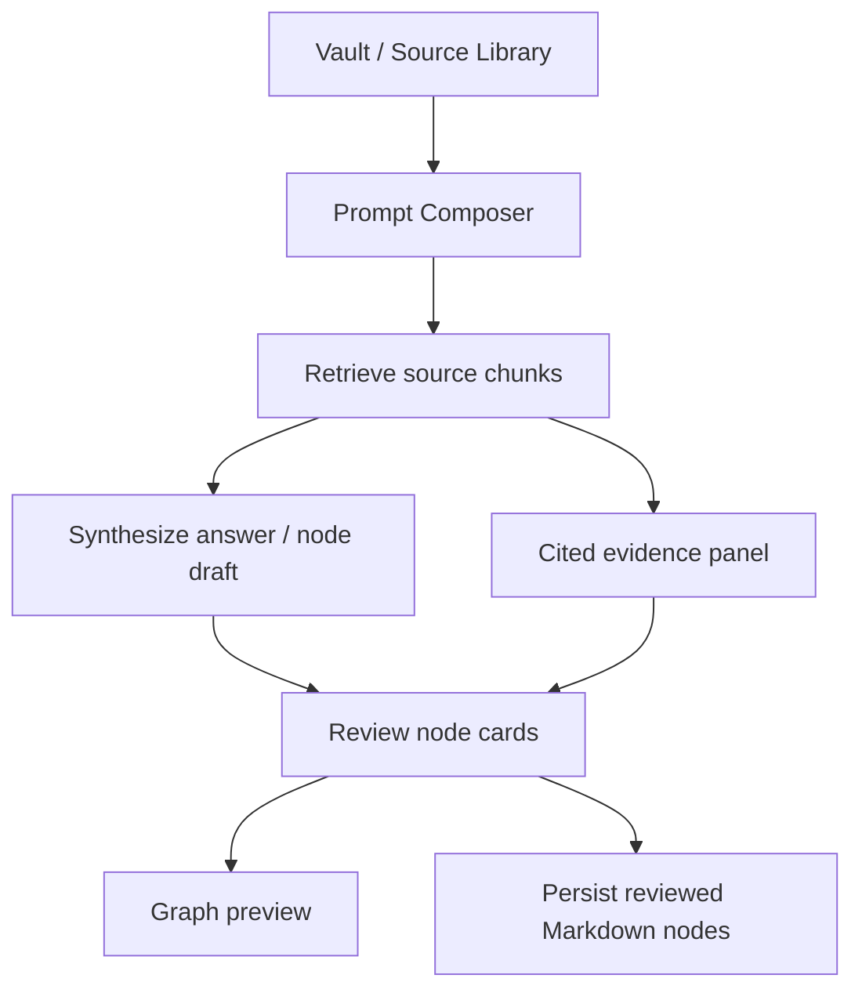
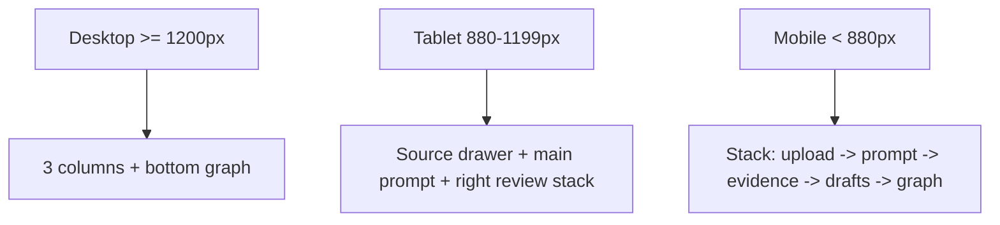
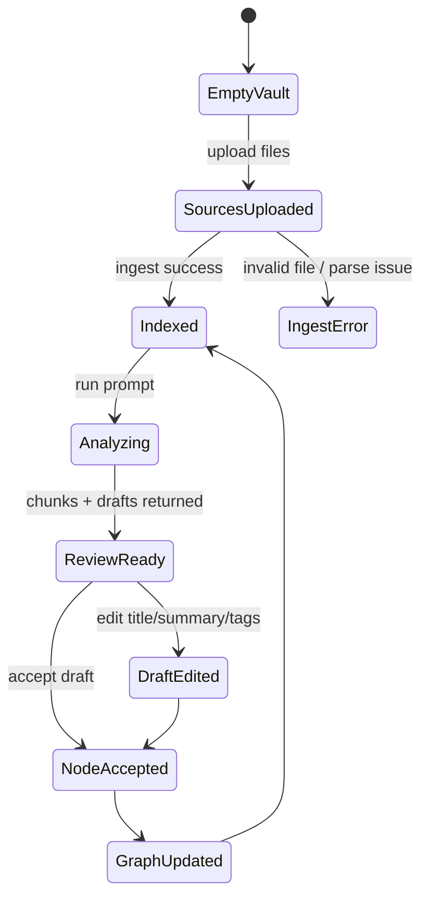

# Prompt-first Workspace Wireframe

Last updated: 2026-06-17

## Muc tieu review

Day la phac thao UI truoc khi trien khai code. Pham vi chi la desktop
webview/Tauri viewport cho Learn Alone, huong den workflow giong NotebookLM:
upload nhieu source, hoi/nhap prompt, RAG retrieve chunk, tao node draft, review
va xem graph preview.

Khong trien khai UI trong buoc nay. Sau khi review, layout duoc duyet se duoc
chuyen thanh React/CSS.

## Nguyen tac thiet ke

- Man hinh dau tien phai la workspace lam viec, khong phai landing page.
- Prompt composer la hanh dong chinh, nhung source library phai luon thay duoc.
- Ket qua AI/RAG phai co citation/source anchor de nguoi dung audit.
- Node draft va graph preview di cung nhau, tranh cam giac chi la chatbot.
- Giao dien phai day du thong tin nhung van doc duoc tren desktop 1366px+.
- Mobile/tablet chi can stack sach; desktop la target chinh.

## Information architecture



## Desktop wireframe

Target viewport: `1440 x 900`

```txt
+--------------------------------------------------------------------------------+
| Learn Alone                         Vault: D:\...\vault     Search   Settings  |
+--------------------------+----------------------------------+------------------+
| SOURCE LIBRARY           | PROMPT / ANALYZE                 | PIPELINE         |
|                          |                                  |                  |
| [ Upload sources ]       | +------------------------------+ | 01 Summarize     |
| Drop .md .txt .pdf       | | What did you learn today?    | | 02 Filter        |
|                          | |                              | | 03 Split nodes   |
| Filters                  | | Prompt text area             | | 04 Link graph    |
| [All] [Indexed] [Issue]  | |                              | |                  |
|                          | +------------------------------+ | NODE DRAFTS      |
| Sources                  | [Analyze sources] [Clear]        | +--------------+ |
| - rust-notes.md    24 ch |                                  | | Trait bounds | |
| - tauri-rag.md     18 ch | CONTEXT CHIPS                    | | summary...   | |
| - sqlite-fts.md    31 ch | [Find prerequisites]             | | tags/conf    | |
| - graph-review.md  12 ch | [Extract concepts]               | | Accept Edit  | |
|                          | [Build review cards]             | +--------------+ |
|                          |                                  | +--------------+ |
|                          | RETRIEVED EVIDENCE               | | SQLite FTS   | |
|                          | +------------------------------+ | | summary...   | |
|                          | | source.md:12-31              | | | Accept Edit  | |
|                          | | matching chunk preview       | | +--------------+ |
|                          | +------------------------------+ |                  |
+--------------------------+----------------------------------+------------------+
| GRAPH PREVIEW                                                                     |
|                                                                                   |
|      (Source) ---- prerequisite ---- (Node draft) ---- related ---- (Node draft)   |
|           \                              |                         /              |
|            \------ same-source ----------+------------------------/               |
|                                                                                   |
| Selected node: title, source anchors, relation reasons, confidence                |
+--------------------------------------------------------------------------------+
```

## Layout zones

| Zone | Purpose | Must have | Should avoid |
|---|---|---|---|
| Top bar | App identity, vault status, global search/settings | Vault path/status, compact actions | Marketing copy, oversized logo |
| Source library | Upload and manage sources | Dropzone, filters, indexed/error state, chunk count | Hidden upload flow |
| Prompt composer | Main interaction | Large textarea, contextual chips, analyze action | Chat-only feel with no source context |
| Evidence panel | Trust and traceability | Retrieved chunks, filename/line anchors, score/status | AI answer without citations |
| Pipeline panel | Explain what system is doing | Summarize, filter, split, link statuses | Decorative progress with no meaning |
| Node drafts | Review before persisting | Title, summary, tags, confidence, source anchors, accept/edit | Auto-save without user review |
| Graph preview | Obsidian-like relationship view | Node-edge preview, selected node details | Full graph editor complexity in v1 |

## Responsive behavior



Desktop is the primary product surface. Mobile stacking is for basic review and
manual QA, not the canonical mobile companion UX.

## State sketch



## Visual direction

```txt
Palette: warm white, off-black, light borders, muted semantic tags.
Typography: dense workstation hierarchy, not hero-scale marketing text.
Shape: 6-8px radius, 1px borders, minimal shadow.
Motion: only subtle state transitions; no large decorative animation.
Density: closer to Obsidian/NotebookLM workspace than SaaS landing page.
```

## Trade-off UI layout

| Decision | Scalability | Maintainability | Security | Performance | User experience |
|---|---|---|---|---|---|
| 3-column desktop workspace | Handles source, prompt, review simultaneously | Clear component boundaries | Keeps source status visible | More DOM visible but acceptable | Best for power-user learning flow |
| Bottom graph preview | Can grow into graph editor later | Separable graph component | No extra data exposure | Static preview is cheap | Reinforces node-by-node mental model |
| Evidence always visible | Supports larger RAG workflows | Encourages citation model in code | Reduces blind trust in AI output | Chunk list can be virtualized later | User can verify source quickly |
| Pipeline side panel | Extensible for future AI stages | Explicit stage model | Shows local/cloud stage later | Cheap static state | Makes processing understandable |
| Source library fixed left | Scales until many sources, then needs search | Simple navigation model | Clear file provenance | List virtualization later | Upload and audit are never hidden |

## Review questions

1. Ban muon graph preview nam o day man hinh nhu tren, hay nam ben phai thay
   cho pipeline?
2. Node draft nen uu tien `Accept/Edit` tung card, hay co bulk action
   `Accept selected` ngay v1?
3. Evidence panel nen hien chunk truoc, hay hien answer summary truoc?
4. Source library v1 co can delete/reindex source ngay trong layout nay khong?
5. Man hinh nay nen toi uu cho 1366px laptop hay 1440px+ desktop truoc?

