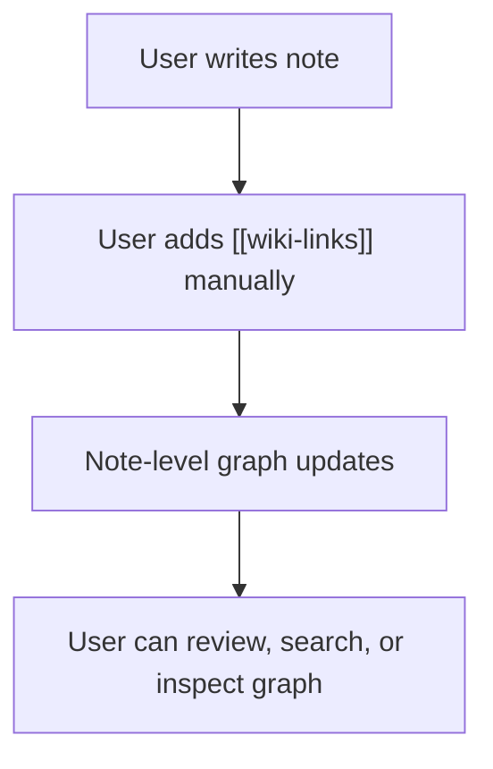
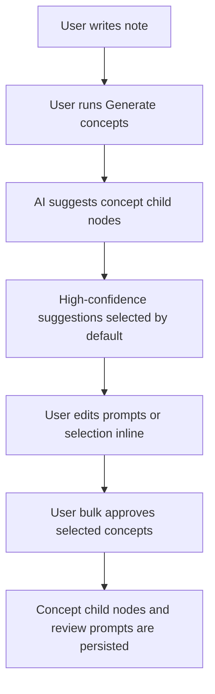

# PET and OpenClaw Learning Ecosystem Requirements

Status: draft for product review
Last updated: 2026-06-22
Owner: Learn Alone product direction

## 1. Summary

Learn Alone is a manual-first, local-first personal learning note app. The core
product is not a chatbot and not a fully autonomous agent. The core product is a
desktop knowledge workstation where a learner writes notes, links notes with
`[[wiki-links]]`, builds a note-level knowledge graph, and turns notes into
reviewable knowledge.

PET and OpenClaw are future experience layers around that core:

- PET is an in-app companion that supports the learner emotionally and
  operationally.
- OpenClaw is an optional agent runtime layer for PET-assisted workflows such
  as visualization, study coaching, and curated discovery.
- The local app remains the owner of the vault, note graph, RAG index,
  citations, review queue, and canonical data.
- AI and OpenClaw suggestions are never required for the core note workflow and
  never mutate canonical user data without approval.

The product direction is:

> Manual-first notes, AI-assisted suggestions, PET as a learning companion, and
> OpenClaw as a bounded agent runtime layer.

## 2. User Painpoints

### 2.1 Primary painpoint

Learners can write notes, but notes often do not become knowledge they can
review, connect, and reuse. The product must help turn raw notes into durable
learning objects without forcing the learner through a heavy workflow.

### 2.2 Specific painpoints

1. The learner writes useful notes but does not know how to split them into
   clear reviewable ideas.
2. The learner has many notes but does not see how those notes relate.
3. The learner avoids review because the material feels difficult, vague, or
   intimidating.
4. The learner does not know what to review next.
5. The learner wants help, but does not want an AI assistant to interrupt the
   writing flow or silently change their knowledge base.
6. The learner wants the app to feel supportive and calm during long study
   sessions, not like another task manager.

## 3. Product Principles

1. Manual-first: the app must be useful without AI, PET, or OpenClaw.
2. Local-first: the vault remains canonical and human-auditable.
3. Notes are primary graph nodes: the default graph shows notes and manual
   note links, not every generated concept.
4. AI is suggestion-only: AI may propose links, child concepts, review prompts,
   visualizations, and reading material, but the learner stays in control.
5. PET reduces friction: PET must help the learner continue studying, not add
   steps or pressure.
6. Evidence is visible, not blocking: source evidence should be easy to inspect
   but should not make every normal action feel like an audit.
7. Privacy beats automation: no raw note, source, vault, or personal learning
   memory leaves the app without explicit user approval.

## 4. Stakeholders

### 4.1 Primary stakeholder

The primary stakeholder is an individual learner on a student laptop. The target
machine is a normal Windows or macOS laptop with 8-16 GB RAM, a common CPU, and
no required discrete GPU.

### 4.2 Secondary stakeholder

A parent or teacher coach may receive user-exported progress reports. This is
not a live dashboard, not a shared account system, and not cloud sync.

### 4.3 Maintainer stakeholder

The engineering team must be able to maintain PET behavior, OpenClaw
integration, note graph behavior, and privacy boundaries without coupling them
into one untestable agent system.

## 5. Current Product Core

The current app direction remains:

- Desktop-first on Windows and macOS.
- Local filesystem vault as canonical data.
- SQLite as rebuildable index and metadata store.
- Note workspace for writing and source updates.
- Review workspace for RAG-style study.
- Graph workspace for note relationships and suggestion approval.
- Provider-agnostic AI configuration with no plaintext key persistence.

This PRD refines the future direction. It does not replace the local vault or
app-owned RAG architecture.

## 6. Target Information Model

### 6.1 Note

A note is the primary user-authored learning object and the default graph node.

Requirements:

- A note MUST be editable manually.
- A note MUST support `[[wiki-link]]` syntax as the primary manual linking UX.
- A note MAY reference source assets.
- A note MAY have child concept nodes generated or suggested from its content.
- A note SHOULD remain useful as a standalone Markdown file.

### 6.2 Note graph

The default graph is note-level.

Requirements:

- The default graph MUST show notes as primary nodes.
- Manual `[[wiki-links]]` MUST create or update note-level relationships.
- AI link suggestions SHOULD prioritize note-to-note links first.
- Concept child nodes MUST NOT clutter the default graph.
- Concept child nodes MAY be shown when a note is expanded or inspected.

### 6.3 Concept child node

A concept child node is an atomic learning unit derived from a note. It is a
child of a note, not the default graph unit.

Default concept card structure:

- Title.
- Short explanation in learner-friendly language.
- Key points.
- Recall prompt.
- Evidence or source reference when available.
- Confidence and reason metadata.

Quality priority:

1. Atomic.
2. Easy to understand like a short lesson.
3. Source-backed and auditable.

### 6.4 Review prompt

A review prompt is generated from an approved concept child node.

Requirements:

- The default review format SHOULD be recall prompt, not multiple choice.
- A review prompt SHOULD be editable inline during concept review.
- Approved concept child nodes SHOULD auto-create review prompts by default.
- Review grading SHOULD support at least `again`, `hard`, `good`, and `easy`.

## 7. Core User Flows

### 7.1 Manual note flow

Acceptance:

- This flow MUST work without AI, PET, OpenClaw, cloud access, or model access.

### 7.2 AI-assisted note-to-concept flow

Requirements:

- AI MUST be triggered by user command, not by realtime writing interruption.
- AI-generated concept cards MUST be suggestions until approved.
- High-confidence suggestions MAY be selected by default.
- Unchecked or rejected suggestions SHOULD become summarized preference
  feedback.
- Evidence MUST be visible or quickly available but MUST NOT block the normal
  approve flow.

### 7.3 PET companion flow during RAG

Example:

1. User asks: "What did I learn today?"
2. PET immediately shows a short warm bubble and a reading animation.
3. App-owned RAG retrieves local notes, sources, citations, and graph context.
4. Near completion, PET shows a short transition bubble.
5. The app renders the RAG answer with citations.

Requirements:

- PET SHOULD respond quickly with stateful animation and short text.
- PET MUST NOT invent or replace the cited RAG answer.
- PET MAY summarize in very short natural sentences when the content is safe
  and approved for that context.

### 7.4 PET care flow without AI

PET must remain useful even without AI.

Examples:

- If the learner studies for 50 minutes, PET may say: "You studied a lot. Drink
  some water."
- If the learner has been idle, PET may switch to sleep animation.
- If a process fails, PET may show a calm error bubble.

Requirements:

- PET care behavior SHOULD work offline.
- PET care behavior SHOULD use local events and templates.
- PET care behavior MUST be dismissible and non-intrusive.

## 8. PET Requirements

### 8.1 Role by stage

| Stage | PET role | Behavior |
|---|---|---|
| Writing note | Process companion | Quiet, non-blocking, does not interrupt writing |
| Generating suggestions | Process companion | Shows progress, short bubbles, simple animations |
| Reviewing approved concepts | Study coach | Helps reduce fear of difficult concepts |
| Exploring approved knowledge | Coach and guide | Offers visualization, related concepts, and curated reading |
| Long study session | Care companion | Suggests rest, water, or a softer pace |

### 8.2 Default tone

The default PET tone is warm gentle coach.

Requirements:

- PET SHOULD be supportive, calm, and respectful.
- PET SHOULD avoid pressure-heavy language by default.
- PET MAY support personality choices later.
- Personality may affect tone and study strategy, but MUST NOT bypass privacy,
  approval, or data-mutation rules.

### 8.3 PET animation states

Required initial animation states:

- `idle`
- `reading_book`
- `thinking`
- `happy`
- `confused`
- `sleep`
- `listening_to_music`

### 8.4 PET UI placement

Requirements:

- PET SHOULD appear as a small corner companion.
- PET bubbles SHOULD be short and should not cover the editor or review cards.
- PET SHOULD be available in settings for configuration.
- PET MUST be disable-able.

## 9. OpenClaw Requirements

### 9.1 Role

OpenClaw is an optional or advanced agent runtime layer for PET. It may assist
with:

- Visualization generation.
- Top-down concept exploration.
- Curated web discovery.
- Study coaching.
- Monthly learning reflection.
- Agentic workflows initiated or approved by the user.

OpenClaw MUST NOT own:

- The canonical vault.
- The RAG index.
- The source citation model.
- The note graph.
- The review queue.
- The user's approved learning memory.

### 9.2 Security posture

OpenClaw integration MUST be app-scoped.

Requirements:

- OpenClaw MUST receive only the capabilities the app grants.
- OpenClaw MUST NOT receive full filesystem access by default.
- OpenClaw MUST NOT receive raw notes, raw sources, or vault content without
  explicit user approval.
- OpenClaw outputs MUST be treated as suggestions or artifacts until approved.
- OpenClaw-generated changes MUST NOT mutate canonical notes, links, graph
  edges, review prompts, or vault files automatically.

### 9.3 Model access strategy

Preferred model access order:

1. OpenClaw or Codex-backed path for best UX when the user enables it.
2. BYOK or configured external provider fallback.
3. Small local model or deterministic local behavior where feasible.

Requirements:

- Cloud or external model calls MUST have a privacy gate.
- The app MUST continue to provide useful note, graph, review, and PET care
  behavior without external model access.

## 10. Visualization Requirements

### 10.1 Purpose

Visualization should make difficult knowledge approachable. The desired pattern
is top-down concept exploration: start from basic concepts, move through
prerequisites, and then open the harder concept.

### 10.2 Sandbox

Visualization v1 should use a web artifact sandbox.

Requirements:

- Generated visualizations SHOULD run as sandboxed HTML, SVG, Canvas, or React
  preview artifacts.
- Sandbox default MUST deny filesystem access.
- Sandbox default MUST deny network access.
- Visualization artifacts SHOULD be ephemeral by default.
- Users MAY save an artifact into the project or vault intentionally.

### 10.3 UX

Requirements:

- Visualization SHOULD support click targets and pop-up/detail inspection.
- Visualization SHOULD cite the note or concept nodes it is based on.
- Visualization MUST NOT be treated as canonical knowledge until saved or
  approved.

## 11. Curated Web Discovery Requirements

### 11.1 Purpose

PET may help users read more from trustworthy sources after concepts are
approved.

Requirements:

- Web search MUST require confirmation before sending a query outside the app.
- Search queries SHOULD be sanitized and minimized.
- Preferred sources include official documentation, academic papers,
  universities, standards bodies, and reputable technical publications.
- PET SHOULD gently suggest corrections when external sources conflict with the
  user's note.
- PET MUST show citations and reasons for recommended resources.

## 12. PET Memory Requirements

### 12.1 Memory scope

PET may maintain short summaries to personalize help.

Requirements:

- PET memory MAY store short summaries of approved learning activity.
- PET memory MUST NOT store large raw note bodies as its primary memory form.
- PET memory SHOULD include source pointers back to notes or concepts.
- PET memory SHOULD learn from rejected suggestions only as summarized
  preferences.
- PET memory SHOULD auto-compress over time.
- PET memory MUST be user-auditable and deletable.

### 12.2 Monthly reflection

PET may produce monthly reflections based on approved notes, links, review
activity, and taxonomy.

Reflection should answer:

- What areas is the learner getting stronger in?
- What areas need attention?
- What should the learner review next?
- What related topics may be useful?

Requirements:

- Monthly reflection SHOULD use approved taxonomy.
- Taxonomy SHOULD be hybrid approved: AI may suggest, but the user can approve,
  rename, merge, or reject.
- Reflection SHOULD be encouraging and specific.
- Reflection MUST NOT publish or share without user action.

## 13. Coach Export Requirements

The secondary coach stakeholder receives only user-exported reports.

Requirements:

- No live coach account in this scope.
- No cloud dashboard in this scope.
- Exported reports SHOULD contain summaries, roadmap, progress, strengths, and
  next steps.
- Reports SHOULD avoid raw private notes by default.
- Users MAY explicitly include selected notes or examples.

## 14. Future Interfaces

These interfaces are requirements-level contracts, not final code schemas.

### 14.1 `PetEvent`

Represents an app event that PET can react to.

Candidate fields:

- `id`
- `type`
- `createdAt`
- `source`
- `relatedNoteId`
- `relatedConceptId`
- `severity`
- `safeSummary`
- `requiresUserAction`

Candidate event types:

- `note.writing_started`
- `note.writing_idle`
- `note.long_session`
- `note.link_created`
- `concept.suggestion_started`
- `concept.suggestion_ready`
- `concept.approved`
- `rag.requested`
- `rag.retrieving`
- `rag.near_complete`
- `rag.completed`
- `rag.failed`
- `review.due`
- `review.completed`
- `monthly_reflection_due`

### 14.2 `PetManifest`

Defines one PET personality and behavior configuration.

Candidate fields:

- `id`
- `displayName`
- `species`
- `defaultTone`
- `animationMap`
- `dialogueTemplates`
- `strategyWeights`
- `privacyLevel`
- `enabledCapabilities`

### 14.3 `PetMemorySummary`

Stores PET-personalization memory in an auditable way.

Candidate fields:

- `id`
- `summary`
- `sourcePointers`
- `topicIds`
- `confidence`
- `createdAt`
- `lastCompressedAt`
- `retentionPolicy`

### 14.4 `ConceptChildNode`

Represents an approved child concept under a note.

Candidate fields:

- `id`
- `parentNoteId`
- `title`
- `explanation`
- `keyPoints`
- `recallPrompt`
- `evidencePointers`
- `confidence`
- `status`

### 14.5 `AiSuggestion`

Represents a pending suggestion from AI, PET, or OpenClaw.

Candidate fields:

- `id`
- `kind`
- `targetType`
- `targetId`
- `proposedChange`
- `rationale`
- `confidence`
- `selectedByDefault`
- `status`

Candidate kinds:

- `note_link`
- `concept_child`
- `review_prompt`
- `tag`
- `taxonomy`
- `visualization`
- `reading_resource`

### 14.6 `VisualizationArtifact`

Represents a generated visualization preview.

Candidate fields:

- `id`
- `artifactType`
- `sandboxPolicy`
- `sourceNodeIds`
- `sourceConceptIds`
- `files`
- `createdAt`
- `expiresAt`
- `savedAt`

### 14.7 `ExternalSearchRequest`

Represents an explicit, user-approved web discovery request.

Candidate fields:

- `id`
- `sanitizedQuery`
- `userApprovedAt`
- `sourcePolicy`
- `resultCitations`
- `reason`
- `relatedConceptIds`

## 15. Performance Requirements

Target device: student laptop with 8-16 GB RAM, normal CPU, no required discrete
GPU.

Requirements:

- PET bubble reaction SHOULD appear within 300 ms for local events.
- PET animations SHOULD run acceptably on integrated GPU.
- Note editor interactions MUST remain responsive during PET behavior.
- Background PET/OpenClaw work SHOULD be scheduled and interruptible.
- The app MUST NOT use an always-on agent loop by default.
- RAG and visualization SHOULD show progressive feedback when they take longer
  than a short interaction.
- Offline PET care behavior MUST remain available.

Resource targets for future profiling:

| Mode | RAM target | CPU target | Notes |
|---|---:|---:|---|
| App + PET idle | Under 900 MB | Near 0-5% | Target, not yet verified |
| OpenClaw connected idle | Under 1.5 GB | Near 0-5% | Requires profiling |
| Active RAG or visualization | Under 2.5 GB where feasible | Bounded spike | Must not block editor |

## 16. Security and Privacy Requirements

Risk priority:

1. Data leak.
2. Wrong guidance.
3. Battery drain.

Requirements:

- Raw notes, raw sources, vault files, API keys, and personal memory MUST NOT
  be sent outside the app without explicit approval.
- AI, PET, and OpenClaw outputs MUST be treated as untrusted suggestions until
  approved.
- Canonical data mutation MUST require user approval.
- External searches MUST require user confirmation.
- Saved artifacts MUST record source pointers and generation metadata.
- PET memory MUST be auditable and deletable.
- Provider keys MUST use secure storage when persistence is implemented.
- The app MUST keep local note and graph workflows usable when external AI is
  unavailable.

## 17. Usability Requirements

Requirements:

- The default note-to-link workflow SHOULD feel like Obsidian-style writing,
  not a wizard.
- AI suggestions SHOULD reduce work, not add mandatory review steps.
- The primary AI-assisted flow SHOULD be short:
  1. Generate suggestions.
  2. Review selected suggestions and approve.
- PET SHOULD be helpful but quiet by default.
- PET SHOULD be dismissible and configurable.
- PET copy SHOULD be short, warm, and non-judgmental.
- Visualization SHOULD help users move from basic concepts to harder concepts.
- Coach export SHOULD be user-controlled and easy to explain.

## 18. Non-Goals

The following are out of scope for this requirements slice:

- Hardware buddy, ESP32, or M5StickC integration.
- Mobile PET.
- Live coach dashboard.
- Cloud sharing.
- Multi-user collaboration.
- Always-on autonomous agent loop.
- OpenClaw-owned RAG index.
- OpenClaw-owned canonical data.
- Automatic AI mutation of notes, graph edges, review prompts, or vault files.
- Full concept graph as the default graph view.
- Realtime inline ghost-writing in the editor.
- Plugin marketplace.

## 19. Trade-Offs

| Decision | Scalability | Maintainability | Security | Performance | User experience |
|---|---|---|---|---|---|
| Manual-first notes | Scales across users who do not want AI | Keeps core app stable | Avoids external dependency for core workflow | Lightweight | Familiar and controllable |
| Note-level graph default | Avoids graph explosion | Simpler graph model | Less accidental exposure | Faster rendering | Easier to understand |
| Concept child nodes | Scales depth without clutter | Clear parent ownership | Child suggestions stay reviewable | More metadata, manageable | Supports review and RAG |
| AI suggestion-only | Scales safely across AI quality levels | Approval queues are explicit | Prevents silent data corruption | Some extra UI work | Keeps user in control |
| PET as companion | Can expand to many personalities | Needs manifest discipline | Must not bypass policy | Animation overhead must be bounded | Makes studying less lonely |
| OpenClaw as agent layer | Can add advanced workflows | Adapter boundary required | High risk unless scoped | Could be heavy | Strong UX potential |

## 20. Acceptance Criteria

This requirements direction is satisfied when:

- The app remains useful without AI, PET, OpenClaw, cloud access, or model
  access.
- Users can create note links with `[[wiki-link]]`.
- The default graph is note-level.
- AI suggestions are approval-gated and shown outside the writing flow.
- Concept child nodes can be created under notes and used for review.
- Review prompts can be generated and edited.
- PET can provide non-AI care behavior such as long-session rest reminders.
- PET does not block writing or review.
- OpenClaw is documented as an optional agent runtime layer, not canonical data
  ownership.
- Privacy boundaries are explicit and enforceable.

## 21. Open Questions

These questions remain for implementation planning, not for product direction:

1. Exact Markdown format for persisted note child concepts.
2. Exact storage location for PET memory summaries.
3. Exact review scheduler algorithm and due-date policy.
4. Exact OpenClaw adapter protocol.
5. Exact sandbox implementation for visualization artifacts.
6. Exact UX for expanding child concepts in the graph.
7. Exact coach export format.
