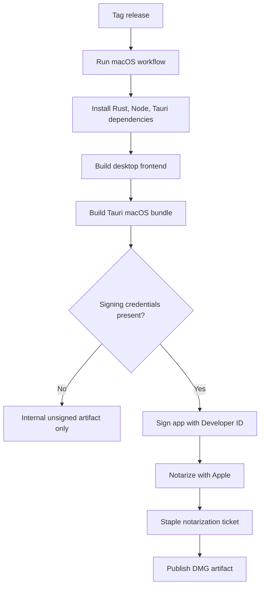

# macOS Production Release

This project targets production desktop distribution on Windows and macOS.
macOS production release is not complete until the app is signed and notarized.

## Requirements

- Apple Developer Program membership.
- A macOS build machine or macOS CI runner.
- Developer ID Application certificate.
- Apple notarization credentials stored as CI secrets.
- Tauri desktop build passing on macOS.

## Secrets

Do not commit these values to the repository:

- Apple certificate private key.
- Apple ID password or app-specific password.
- App Store Connect API key.
- API provider keys for AI features.

Use repository or organization secrets in CI.

## Release Flow

## Current Repository State

The repository includes a manual GitHub Actions workflow scaffold for desktop
release builds. It intentionally does not run on every push because production
signing requires secrets and should be controlled.

## Acceptance Gate

A macOS build is production-ready only when:

- The app installs from the generated macOS artifact.
- Gatekeeper allows the app without manual override.
- The app can create/open the local vault.
- Note, graph, and review workspaces load.
- No API key is written to source files, logs, or vault Markdown.
