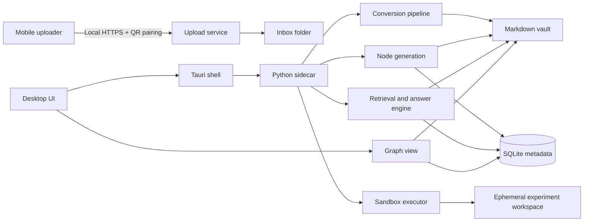
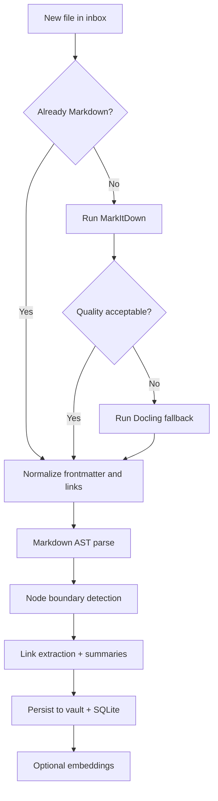
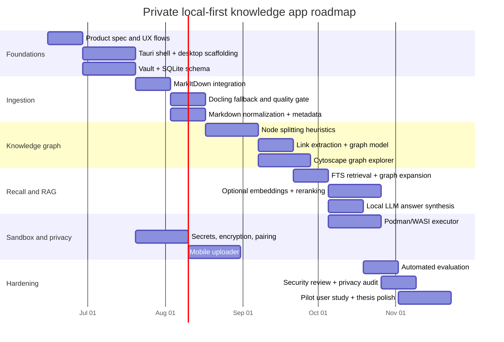

# Private Local-First Knowledge Graph Desktop App for Personal Learning

## Executive Summary

This project is feasible as a serious thesis-grade product **if the scope is kept brutally disciplined**: desktop-first on Windows/macOS, single-user, local storage as the source of truth, PDFs/text/Markdown only, mobile as an uploader rather than a full editing client, and a **dedicated internal executor** instead of making OpenClaw a core dependency. The strongest architecture for that scope is: **Tauri desktop shell + React/TypeScript UI + a packaged Python sidecar for ingestion/ML**, with a **filesystem Markdown vault** as canonical storage and **SQLite** for metadata, full-text search, and optional vector retrieval. For conversion, the most relevant Microsoft project is **MarkItDown** (not “MarkdownKit”); it is a lightweight Markdown converter with explicit security caveats, while **Docling** is a stronger fallback for layout-heavy PDFs. For local LLMs, **Ollama** is the lowest-friction operational choice, while **llama.cpp** gives finer control if you want a thinner runtime or OpenAI-compatible local serving. citeturn22view0turn22view1turn22view4turn20search0turn20search1turn20search2turn6search18turn31search1turn6search3turn31search10

The fastest safe path is **not** to overbuild the “agent” part. OpenClaw’s official docs show a self-hosted gateway for messaging surfaces, plugins, skills, mobile nodes, and multi-agent routing; that is impressive, but it is architecturally aimed at a persistent assistant control plane, not a minimalist embedded experiment runner inside a notes app. On top of that, OpenClaw’s community-skill ecosystem has already attracted documented malware incidents in 2026, which materially changes the risk profile for bundling or exposing third-party skills inside a privacy-first learning app. My recommendation is to **treat OpenClaw as inspiration**, not as your default runtime dependency. citeturn22view3turn23view0turn23view1turn23view2turn10news34turn10news37turn11news30

The real budget driver is **engineering time**, not cloud infrastructure. A local-first single-user version can run with **zero mandatory backend infrastructure** if conversion, indexing, retrieval, graph rendering, and model inference stay on-device. The only non-labor cash costs you may actually need are optional ones such as **Apple Developer Program membership** if you publish an iOS uploader, **SQLCipher Commercial Edition** if you want supported encrypted SQLite for production, or **Docker Desktop** if you choose it instead of Podman for local container sandboxing. citeturn35search0turn35search3turn13search2turn13search13turn35search2turn12search1

The best thesis-friendly recommendation is therefore:

| Decision area | Recommendation | Why |
|---|---|---|
| Desktop shell | **Tauri v2** | Strong trust-boundary model, explicit sidecar permissions, good fit for local sidecar processes. citeturn22view4turn23view3 |
| Canonical data | **Filesystem Markdown vault + assets** | Human-readable, long-lived, easy backup/export, aligns with Obsidian-style expectations; Logseq and Joplin both reinforce the value of Markdown-centered/offline-first data. citeturn28view0turn28view1 |
| Metadata/search | **SQLite + FTS5 + JSON functions + WAL** | Excellent embedded search primitive set with no server dependency. citeturn20search0turn20search1turn20search2 |
| Vector retrieval | **Start optional; add behind an adapter** | `sqlite-vec` is attractive but still pre-v1; do not hard-couple the whole app to it on day one. citeturn22view6 |
| PDF conversion | **MarkItDown first, Docling fallback** | MarkItDown is light; Docling is better on layout-heavy PDFs and still supports local execution. citeturn22view0turn22view1 |
| Graph view | **Cytoscape.js for MVP** | Better fit for a global knowledge graph than a node editor-first library. citeturn8search0turn8search4 |
| Local LLM | **Ollama for operations, llama.cpp as advanced option** | Easiest local deployment vs. maximum control/perf portability. citeturn6search18turn31search1turn6search3turn31search10 |
| Sandbox experiments | **Dedicated internal executor using Podman or WASI** | Safer and simpler than embedding OpenClaw as app core. citeturn12search1turn12search5turn22view7turn22view3 |

## Assumptions and Decision Criteria

This report assumes the scope exactly as requested: **primary desktop targets are Windows and macOS**, the app is **single-user and local-first**, the mobile companion is **uploader-only**, supported ingestion types are **text, Markdown, and PDF**, and **audio is excluded**. I also assume the product goal is **privacy-preserving personal knowledge recall**, not collaborative note-taking, enterprise sync, or autonomous workflow automation. Those assumptions strongly bias the design toward **embedded components, permissive licenses, local model execution, and long-lived file formats**. citeturn28view1turn28view4turn22view3

A useful way to judge every dependency is to ask whether it improves one of six things without damaging the others: privacy, offline function, maintainability, Windows/macOS packaging, license cleanliness, and thesis delivery speed. On those criteria, many fashionable AI-agent stacks score worse than boring embedded components. OpenClaw is a good example: its gateway/node/plugin design is powerful, but it solves a broader and riskier problem than your app actually needs. By contrast, SQLite, Markdown files, and local HTTP upload are boring but very aligned with the problem. citeturn23view0turn23view1turn20search0turn28view4

One correction matters up front: the Microsoft GitHub project relevant to your conversion pipeline is **MarkItDown**, not “MarkdownKit.” MarkItDown is Microsoft’s lightweight Python tool for converting many file types into Markdown, and it explicitly warns that it performs I/O with the privileges of the current process. That warning is not cosmetic; it means you should isolate conversion in a constrained sidecar/executor rather than running it directly inside your UI process. citeturn22view0turn10search4

## Comparable Projects and Component Landscape

### Comparable projects worth studying

These projects are useful mostly as **pattern references**, not as drop-in foundations.

| Project | What it teaches well | Why it is not the best direct core for your app | License / posture |
|---|---|---|---|
| **Logseq** | Privacy-first knowledge management, local-note workflows, Markdown/Org support, mobile presence. citeturn28view0 | More outliner/block-knowledge-system than “private PDF/text ingestion + recall + sandboxed experiments.” |
| **Joplin** | Offline-first behavior, Markdown notes, import/conversion flows, searchable local data, E2EE sync concepts. citeturn28view1 | Strong notes app, but not graph-native enough for your core UX. |
| **SiYuan** | Fine-grained block references, Markdown WYSIWYG, SQL embed, PKM focus. citeturn28view2 | Heavier ecosystem and feature surface than needed for a thesis MVP. |
| **AppFlowy** | Cross-platform architecture with Flutter + Rust, “control your data” positioning. citeturn28view3 | Collaboration/workspace product bias; **AGPL-3.0** makes direct code reuse unattractive if you want a clean permissive distribution path. citeturn28view3turn29search7 |
| **LocalSend** | Local-network mobile-to-desktop transfer with HTTPS and no third-party servers. citeturn28view4turn19search0 | Not a knowledge app, but excellent inspiration for your uploader transport. |
| **OpenClaw** | Self-hosted gateway, mobile nodes, plugin/skill model, local-first assistant concepts. citeturn22view3turn23view0turn23view1 | Over-scoped for an embedded learning app; community-skill risk is non-trivial. citeturn10news34turn10news37turn11news30 |

### Converter stack

| Tool | Strengths | Main drawbacks | License compatibility | Recommendation |
|---|---|---|---|---|
| **MarkItDown** | Lightweight; converts PDF and many common formats to Markdown; designed for LLM/text-analysis pipelines; easy Python integration. citeturn22view0turn10search4 | Output is optimized for downstream analysis, not always for human-perfect fidelity; security note about I/O privileges means you must sandbox it. citeturn22view0 | **MIT**; clean for permissive stacks. citeturn10search4 | **Primary converter for MVP** |
| **Docling** | Rich PDF understanding: reading order, tables, formulas, layout; exports Markdown and JSON; designed to run locally in sensitive or air-gapped environments. citeturn22view1 | Heavier than MarkItDown; more processing overhead and complexity. | **MIT**; clean for permissive stacks. citeturn22view1 | **Fallback for hard PDFs** |
| **Pandoc** | Extremely mature universal AST-based converter with modular readers/writers and filter support. citeturn30view0turn30view1 | **GPL-2.0-or-later**; legal review needed if bundling directly into a proprietary distribution. citeturn30view0 | Strong copyleft relative to MIT/Apache options. | **Use as optional normalization/export tool, not core dependency** |
| **Marker** | Strong PDF-to-Markdown/JSON feature set; extracts structure and works on GPU/CPU/MPS. citeturn22view2 | **GPL-3.0** and the repo explicitly states commercial self-hosting requires a license. citeturn22view2 | High license friction for a clean distributable app. | **Avoid in shipped core unless you accept GPL/commercial terms** |

### Graph and visualization stack

| Tool | Strengths | Main drawbacks | License compatibility | Recommendation |
|---|---|---|---|---|
| **Cytoscape.js** | Mature graph visualization library, optimized for relational graph rendering, production-proven, headless graph operations available. citeturn8search0turn8search4 | Editing UX is not as node-canvas-centric as React Flow. | **MIT**. citeturn8search4 | **Best MVP choice for global knowledge graph** |
| **React Flow** | Excellent for interactive node-based UIs and custom editors. citeturn9search0turn9search1 | Better for canvas/editor metaphors than for a dense Obsidian-style global graph; may tempt overbuilding. | **MIT**. citeturn9search0turn9search1 | **Add later if you need an editable node canvas** |
| **ELKjs** | Strong automatic layered layouts for node-link diagrams. citeturn8search2turn8search10 | **EPL-2.0** adds more license review overhead than MIT/Apache; layout tuning can get fiddly. | **EPL-2.0**. citeturn8search10 | **Optional layout engine, not required for MVP** |
| **D3** | Extremely flexible visuals and charting. citeturn8search3turn8search7 | Lower-level; more engineering time to get polished graph interactions. | **ISC**. citeturn8search7 | **Use for custom mini-visuals, not the main graph view** |

### Storage, retrieval, and local AI components

| Component | Strengths | Main drawbacks | License compatibility | Recommendation |
|---|---|---|---|---|
| **SQLite + FTS5 + JSON + WAL** | Embedded, durable, rich text search, JSON metadata, local transaction support; perfect for single-user desktop. citeturn20search0turn20search1turn20search2 | Native vector search is not built in. | Permissive/low-friction in practice; verify your distribution policy if needed. | **Metadata/search default** |
| **sqlite-vec** | Tiny vector extension that runs anywhere SQLite runs; no extra server. citeturn22view6 | **Pre-v1** with breaking changes expected. citeturn22view6 | **MIT / Apache-2.0 dual-license**. citeturn22view6 | **Use behind an adapter; optional in MVP** |
| **LanceDB** | Embedded library with vector, full-text, and hybrid search; local OSS mode with TS/Python/Rust. citeturn27view2turn27view3 | More vector/data-platform oriented than a simple personal vault. | **Apache-2.0**. citeturn27view3 | **Best upgrade path if SQLite vectors become limiting** |
| **Qdrant local mode** | Same API locally without a server; useful for prototyping and testing. citeturn27view1turn27view0 | Local mode is explicitly positioned for dev/prototyping/testing, and the ecosystem is Python-first. citeturn27view1 | **Apache-2.0**. citeturn26search0turn26search2 | **Prototype option, not my primary desktop store** |
| **LMDB** | Very fast embedded KV store. citeturn34search12turn34search13 | Poor fit for ad-hoc metadata queries and text search compared with SQLite. | **OpenLDAP Public License**. citeturn34search0 | **Good cache, weak primary store** |
| **libmdbx** | Fast embedded KV store with Apache-2.0 license. citeturn34search1 | Same “KV-first” mismatch for graph/RAG metadata. | **Apache-2.0**. citeturn34search1 | **Cache/queue candidate only** |
| **LlamaIndex** | Strong data ingestion/retrieval framework in Python/TypeScript; built for LLM apps over your data; includes evaluation tooling. citeturn16search15turn6search0turn16search3 | Easy to over-adopt when a custom pipeline would be simpler. | **MIT**. citeturn6search8 | **Good accelerator, not mandatory** |
| **Haystack** | Modular production-oriented orchestration for RAG and agents. citeturn6search1turn6search9 | Heavier framework bias than you need for a local personal app. | **Apache-2.0**. citeturn6search9 | **Useful if your thesis emphasizes experimentation** |
| **Sentence Transformers** | Mature local embeddings and rerankers; retrieval and reranking in one ecosystem. citeturn33view1 | PyTorch-heavy compared with smaller ONNX-only stacks. | **Apache-2.0**. citeturn33view1 | **Excellent reranker or embedding backup** |
| **Ollama** | Easiest local model runner; supports local models and OpenAI-compatible APIs. citeturn6search18turn31search1turn31search8 | Another local service to package/manage. | **MIT** for the OSS repo/CLI. citeturn6search2turn6search6 | **Recommended default local runner** |
| **llama.cpp** | Minimal-setup local inference on many hardware types; built-in OpenAI-compatible server. citeturn6search3turn31search10turn31search0 | Lower-level operational UX than Ollama. | **MIT**. citeturn6search7 | **Best advanced/local-control option** |

### License guidance

If you want a low-friction thesis project that can later become a commercial or closed-source app, the cleanest default is a **permissive stack**: MIT, Apache-2.0, BSD-style, or equivalent. GNU’s AGPL is a copyleft license designed for network server software, and the GNU GPL FAQ explicitly highlights the care needed when combining copyleft and other libraries. That makes **AppFlowy, PairDrop, Marker, and any other GPL/AGPL code poor choices for your shipped core** unless you intentionally accept those obligations. This is not legal advice, but it is a practical engineering rule that will save you pain later. citeturn29search7turn29search0turn18search2turn22view2turn28view3

## Recommended Architecture and Trade-Offs

### Recommended reference architecture



This architecture keeps the **vault human-readable**, keeps the **index/search state replaceable**, and keeps risky or heavy work **outside the UI process**. Tauri’s model explicitly separates the Rust core from the frontend WebView and supports packaged sidecars with permission controls, which is exactly what you want for a converter/indexer/executor process. citeturn22view4turn23view3

### Desktop stack trade-offs

| Stack | Strengths | Risks / costs | Verdict |
|---|---|---|---|
| **Tauri + React/TS + sidecars** | Secure-by-default posture is a core design goal; sidecars are first-class; good fit for packaged Python/Rust helpers. citeturn22view4turn23view3 | More integration work than Electron if your team lives entirely in Node. | **Best overall fit** |
| **Electron + React/TS + child processes** | Huge ecosystem; one-JS-stack convenience; Chromium/Node familiarity. Electron officially documents a strong security checklist and multi-process architecture. citeturn22view5turn23view4turn23view5 | Bigger runtime footprint and a larger attack surface if security hygiene slips. | **Good fallback if team is already Electron-strong** |
| **Native split WinUI + SwiftUI** | Deepest OS integration; high-performance native feel on each platform. citeturn21search0turn21search1 | Two UI stacks, duplicated work, slower thesis delivery. | **Not worth it for this scope** |

My recommendation is **Tauri for the shell, web tech for UI, Python for ingestion/ML, and Rust only where it buys you security/process control**. That keeps delivery speed high without handing the whole trust boundary to a browser-style app model. citeturn22view4turn23view3

### Storage and indexing options

| Option | Data model | Best use | Weakness | Recommendation |
|---|---|---|---|---|
| **Filesystem vault + SQLite** | Markdown files + attachments on disk; SQLite stores node metadata, anchors, search index, personalization state. | Best for Obsidian-style longevity and single-user desktop. | Requires you to manage cross-file/index consistency. | **Recommended default** |
| **Filesystem vault + LanceDB** | Files on disk; LanceDB for vectors/hybrid retrieval. | Better if semantic retrieval dominates. citeturn27view2turn27view3 | Heavier than you need initially. | **Later upgrade path** |
| **LMDB/libmdbx primary store** | KV-first. | Cache, queues, append-only event/log use cases. citeturn34search1turn34search12 | Poor ad-hoc query ergonomics for graph/RAG metadata. | **Do not use as primary app database** |
| **Qdrant local mode** | Python-local vector store with server parity. citeturn27view1 | Fast prototyping. | Becomes awkward as the primary app substrate outside Python. | **Experimentation only** |

The core design rule should be: **the vault is the product; the database is an index**. That gives you simpler exports, easier backups, and far less regret if you ever replace the retrieval stack. Logseq and Joplin both reinforce how durable Markdown-centered and offline-first products can be. citeturn28view0turn28view1

### Sandboxed experiment execution trade-offs

| Option | What it looks like | Pros | Cons | Recommendation |
|---|---|---|---|---|
| **WASI / Wasmtime micro-executor** | Run restricted WebAssembly snippets or precompiled tools. | Tight control of capabilities; deterministic; light isolation story. Wasmtime emphasizes configurable CPU/memory control and WASI support. citeturn22view7turn12search7 | Harder for ordinary Python-centric “experiments.” | **Excellent for deterministic mini-demos** |
| **Rootless Podman executor** | Launch per-experiment containers with read-only mounts and quotas. | Free/open source container tool; runs on Mac/Windows via managed VM; strong practical isolation. citeturn12search1turn12search5turn13search1 | More packaging complexity. | **Best general experiment sandbox** |
| **Docker Desktop executor** | Same model via Docker. | Familiar developer tooling; broad ecosystem. citeturn12search0turn12search4 | Paid plans may apply depending on organization/use; avoidable if Podman meets needs. citeturn35search2 | **Acceptable, but Podman is cleaner on cost** |
| **OpenClaw as experiment runtime** | Expose experiment tools via gateway/skills/plugins. | Rich agent abstractions; node/mobile patterns. citeturn22view3turn23view1 | Overkill and materially riskier because of skills/plugin attack surface. citeturn10news37turn11news30 | **Do not make this your core approach** |
| **Firecracker microVMs** | True microVM isolation. | Strong isolation and very fast startup on Linux. citeturn12search2turn12search10 | Linux-centric; awkward on Windows/macOS developer desktops. | **Good for CI or future server mode, not MVP desktop** |

## Conversion, Node Generation, and RAG Design

### Conversion pipeline

The conversion pipeline should be intentionally simple:



That design matches the real strengths of the tools. MarkItDown is light and easy to package, but its own README makes clear it is tuned for text-analysis pipelines rather than perfect human-facing rendering. Docling is where you go when the PDF itself is the problem: reading order, tables, formulas, layout, and structured export are exactly what it is built for, and it explicitly supports local execution for sensitive data. Pandoc is still valuable, but mostly as a **secondary normalization/export tool**, not as the center of your PDF pipeline. citeturn22view0turn22view1turn30view0turn30view1

I would package conversion like this:

```text
desktop-app/
  src-tauri/           # shell + process control
  ui/                  # React/TypeScript
  sidecar-python/
    convert.py
    ingest.py
    rag.py
  vault/
    inbox/
    nodes/
    assets/
    .app/
      index.sqlite
      cache/
      experiments/
```

That lets you keep the whole data lifecycle inspectable, debug-friendly, and recoverable without being trapped inside a proprietary local database. The sidecar model also aligns with Tauri’s official sidecar support and permissioned execution model. citeturn23view3

### Node-splitting heuristics

This is the part that will decide whether your app feels smart or annoying.

A good heuristic stack is:

| Stage | Rule | Why it matters |
|---|---|---|
| **Structural split** | Split on headings, list roots, theorem/example blocks, quote/code fences, and page boundaries imported from PDF metadata. | Preserves author intent and source traceability. |
| **Length guardrails** | Aim for ~150–400 tokens per node, with a hard max around 700 except for deliberately atomic objects like tables or formulas. | Prevents huge “blob nodes” that ruin both recall and retrieval. |
| **Semantic cohesion check** | If cosine similarity between adjacent paragraphs is low, split even under the token budget; if high, merge small fragments. | Stops arbitrary chopping. |
| **Concept extraction** | Extract candidate concepts, entities, formulas, and glossary terms from each node. | Enables graph links and targeted retrieval. |
| **Link typing** | Create `parent/child`, `next`, `same-source`, `mentions`, `semantic-near`, and `prerequisite` edges. | Keeps the graph useful instead of visually noisy. |
| **Deduplication** | Use normalized title + hash + embedding similarity to collapse near-duplicates. | Prevents graph sprawl. |
| **Explainability metadata** | Store `source_file`, `page_range`, `section_path`, `conversion_tool`, `node_reason`, and `created_from_node_ids`. | Critical for trust and debugging. |

The single biggest product mistake would be letting the LLM invent all boundaries. Use the LLM as a **post-processor**, not the initial segmenter. Boundary proposals should start with deterministic structure from Markdown/PDF parsing, then allow an LLM or reranker to adjust merges/splits when confidence is low. MarkItDown, Docling, and Pandoc all preserve enough structure to make this possible if you keep page/heading anchors through the pipeline. citeturn22view0turn22view1turn30view0

### RAG pipeline for “I forgot this topic” recall

For a personal knowledge system, a **graph-aware hybrid retriever** is better than plain vector search.

Recommended retrieval order:

| Step | Retrieval action | Why |
|---|---|---|
| **Lexical pass** | Query SQLite FTS5 over titles, headings, summaries, aliases, formulas, and concept fields. citeturn20search0 | Fast, good for exact recall, symbols, and named concepts. |
| **Graph expansion** | Expand one hop to parent/child/prerequisite nodes and same-source neighbors. | Rebuilds context instead of returning isolated chunks. |
| **Optional semantic pass** | Query vectors with sqlite-vec or LanceDB if lexical confidence is low. citeturn22view6turn27view2 | Helps with paraphrase recall. |
| **Rerank** | Use a local reranker from Sentence Transformers or a strong local model. citeturn33view1 | Improves final grounding quality. |
| **Answer synthesis** | Prompt local LLM to answer using cited node snippets and explain via the graph path. | Better trust, better relearning. |

If you want a framework, LlamaIndex is the best fit when you want to move fast and still keep Python/TypeScript options plus evaluation support. Haystack is stronger if the thesis emphasis is on modular pipeline experimentation and explicit orchestration. For a student team, though, it is completely reasonable to build the first retriever yourself on top of SQLite + optional vectors and only add a framework if the orchestration starts to get messy. citeturn16search15turn6search0turn16search3turn6search1turn6search9

## Privacy, Security, and Sandboxed Experiments

### Storage privacy and secrets

Your privacy story should have **three layers**, not one.

First, rely on **whole-disk encryption** when the OS supports it. Windows’ BitLocker is designed to protect volumes against data theft or exposure from lost or stolen devices, and Apple’s FileVault protects data at rest on Macs, with Apple explicitly noting its extra security value even on Apple silicon/T2 devices. citeturn14search4turn15search1turn15search3

Second, store **app secrets** using the OS secret store, not in plaintext config files. On Windows, `CryptProtectData` in DPAPI encrypts data so it is typically decryptable only by the same user on the same machine; on Apple platforms, Keychain Services stores small chunks of user data in an encrypted database on disk. That makes them the right place for vault keys, pairing keys, and any optional model-provider credentials. citeturn14search6turn14search3turn14search10

Third, offer **app-level encrypted storage** for the local metadata DB if the product moves beyond a thesis prototype. SQLCipher adds AES-256 encryption and related protections to SQLite, and Zetetic’s commercial offering starts at **$999 per application per year** if you need support/commercial packaging. That is optional for MVP, but very defensible for a privacy-first production version. citeturn13search3turn13search2turn13search13

### Mobile-to-desktop upload security

For uploader-only mobile support, do **not** build sync first. Build **pair-once local upload** first.

The best pattern is a LocalSend-like transport: desktop app opens a local HTTPS service, shows a QR code, mobile scans it, and uploads to the desktop inbox over the local network. LocalSend’s own architecture is local-network only, uses REST plus HTTPS, and explicitly avoids third-party servers. That is almost exactly the security and UX profile you want. citeturn28view4turn19search0

I would implement upload pairing with these controls:

| Control | Recommendation |
|---|---|
| Pairing | QR code with short-lived public key + pairing token |
| Transport | Local HTTPS only; never relay through vendor servers |
| Authorization | Single-user allowlist of paired devices |
| File path | Upload only into `vault/inbox/`, never arbitrary paths |
| Ingestion | Quarantine uploaded files before conversion |
| Audit | Record original filename, SHA-256, device ID, time, and conversion status |

This is simpler than cross-device sync, aligns with your single-user assumption, and keeps the privacy promise honest.

### Sandbox design

The sandbox is where projects like this go from “cool” to “oops, I gave an LLM local code execution.” So be strict.

Your default sandbox policy should be:

| Surface | Default policy |
|---|---|
| Network | **Deny all** unless user explicitly enables a per-experiment allowlist |
| Vault access | **Read-only** mounts to specific source files only |
| Output | Write only to ephemeral workspace and approved export folder |
| Runtime | Rootless container or WASI instance |
| Quotas | CPU, RAM, process count, disk quota, wall-clock timeout |
| Secrets | Never inherit host environment by default |
| Visibility | User sees exact command, inputs, outputs, files touched |

This is another reason I do **not** recommend using OpenClaw as the core experiment engine. OpenClaw skills are Markdown instruction files, can inject environment values for runs, and are loaded from multiple locations including local overrides and community sources; that is congruent with an assistant platform, but it is more dynamic than you want for a notes app’s default trust model. The recent malicious-skill incidents make that even harder to justify. A dedicated internal executor is simpler to reason about and easier to audit. citeturn23view1turn23view2turn10news37turn11news30turn11news31

### Offline LLM options

For a privacy-first experience, local inference is the baseline:

| Runner | Best use | Comments |
|---|---|---|
| **Ollama** | Easiest deployment and model management | Good API ergonomics and OpenAI compatibility for existing clients. citeturn6search18turn31search1turn31search8 |
| **llama.cpp** | Maximum local control and slimmer runtime | Strong choice if you want to embed or tightly control inference. citeturn6search3turn31search10turn31search0 |
| **Sentence Transformers** | Local embeddings and reranking | Great as a retrieval layer even if generation runs elsewhere. citeturn33view1 |

A practical model strategy is:

- **MVP**: no generation model required for ingestion; use deterministic parsing + optional embeddings only.
- **Standard**: small local instruct model for recall/explanations, plus a local embedding model.
- **Full-featured**: add a local reranker and optional user-selectable cloud fallback for people who knowingly trade privacy for quality.

## Resource, Cost, and Roadmap

### Development effort

This project is not a one-person weekend app if you want it polished, but it is very doable as a thesis or small capstone if you freeze the scope early.

| Role | MVP | Standard | Full-featured |
|---|---:|---:|---:|
| Product/UX | 0.5–1 PM | 1–2 PM | 2–3 PM |
| Desktop/frontend engineer | 2–3 PM | 4–6 PM | 7–10 PM |
| Ingestion/RAG engineer | 2–3 PM | 4–5 PM | 6–8 PM |
| Systems/security engineer | 0.5–1 PM | 1.5–2.5 PM | 3–5 PM |
| QA/evaluation | 0.5 PM | 1–2 PM | 2–4 PM |
| **Total** | **5.5–8.5 PM** | **11.5–17.5 PM** | **20–30 PM** |

Here, “PM” means person-months. For a student team, that maps roughly to:

- **MVP**: 2 people over 10–12 weeks
- **Standard**: 2–3 people over 4–6 months
- **Full-featured**: 3–5 people over 6–10 months

### Cost model

The most useful way to think about cost is to separate **labor**, **direct cash outlays**, and **optional commercial extras**.

#### Scope table

| Scope | Included | Estimated labor | Direct cash outlay excluding salaries | Notes |
|---|---|---:|---:|---|
| **MVP** | Desktop app, text/md/pdf ingest, MarkItDown + Docling fallback, vault + SQLite, graph explorer, basic recall chat, no app-store mobile release, no heavy sandbox | 5.5–8.5 PM | **$0–$1,500** | Can be near-zero cash if you use existing hardware and all-permissive OSS |
| **Standard** | Mobile uploader, optional vectors, reranking, polished graph UX, rootless container/WASI executor, encryption options, eval harness | 11.5–17.5 PM | **$500–$4,000** | Mostly hardware, signing, optional support tools |
| **Full-featured** | Store-published uploader, advanced personalization, stronger sandbox UX, notarization/signing hardening, broader evaluation and support tooling | 20–30 PM | **$2,000–$12,000+** | Labor dominates; direct spend rises mainly from release/compliance/tooling |

These dollar ranges are **author estimates**, not vendor quotes. The big idea is simple: for a local-first product, **cloud infra is not what hurts you**. Labor, QA, packaging, and security hardening are what hurt you.

#### Optional paid line items

| Item | When you need it | Cost |
|---|---|---|
| **Apple Developer Program** | If you publish an iOS uploader or distribute outside very limited internal/testing paths | **$99/year**. citeturn35search0turn35search3 |
| **SQLCipher Commercial Edition** | If you want supported encrypted SQLite packaging/commercial support | **Starting at $999/app/year**. citeturn13search2 |
| **Docker Desktop** | If you choose Docker over Podman and your use case requires paid terms/features | Personal $0, Pro $9 annual / $11 monthly, Team $15 annual / $16 monthly per user. citeturn35search2 |
| **React Flow Pro** | Only for premium examples/support; the core library remains MIT/free | **$289/month** for Pro access. citeturn9search3turn9search9 |

### Local versus server LLM cost

| Mode | Privacy | Cash cost profile | UX profile | Recommendation |
|---|---|---|---|---|
| **Fully local** | Best | Near-zero marginal cost after hardware | Higher latency, more hardware sensitivity | **Default** |
| **Hybrid fallback** | Medium | Variable API spend | Better answer quality in edge cases | Optional only |
| **Server-first** | Worst | Recurring and usage-sensitive | Simplest model quality path | Not aligned with your brief |

If you stay local with Ollama/llama.cpp and local upload transport, there is no mandatory cloud bill. That is the whole advantage of this product idea. citeturn6search18turn31search1turn6search3turn28view4

### Timeline and milestones

A realistic **standard-scope** delivery plan is about **24 weeks**.



This timeline assumes you **do not** try to solve collaboration, real sync, OCR-heavy multimodal input, or OpenClaw-style assistant orchestration in the first major iteration.

## Evaluation, Recommendations, and Open Questions

### Testing and evaluation plan

Your evaluation should have **four layers**.

#### Conversion and node-quality evaluation

| Metric | How to measure | Suggested acceptance target |
|---|---|---|
| Markdown structural fidelity | Compare headings/lists/tables/page anchors against hand-checked gold docs | High enough that users can trust source traces |
| Boundary F1 | Human-labeled node boundaries vs. automatic node boundaries | >0.75 in pilot corpus |
| Concept coverage | Ratio of gold concepts present in generated nodes | >0.85 on curated study sets |
| Duplicate-node rate | Near-duplicate nodes per document/corpus | <5% after dedupe |
| Traceability | % of generated nodes with correct source file + section + page metadata | ~100% |

These targets are **recommended engineering targets**, not vendor guarantees.

#### Retrieval and answer evaluation

For RAG, use both framework-assisted evals and human review. Ragas is explicitly built to move from ad hoc “vibe checks” to systematic evaluation loops. TruLens’ “RAG triad” emphasizes **context relevance, groundedness, and answer relevance**, which is exactly the right lens for your app. DeepEval is useful when you want CI-style regression tests around hallucination, relevance, and pipeline behavior. LlamaIndex also provides evaluation modules if you adopt it for orchestration. citeturn16search4turn16search18turn16search1turn16search13turn16search3

Recommended retrieval metrics:

| Metric | Why it matters |
|---|---|
| Precision@k / Recall@k | Does the app fetch the right nodes? |
| nDCG / ranking quality | Are the best nodes near the top? |
| Groundedness | Does the answer stay anchored to retrieved nodes? |
| Answer relevance | Does it actually answer the user’s recall question? |
| Citation coverage | Can the answer show its graph/source path? |

#### Security and privacy evaluation

| Check | What to test |
|---|---|
| Offline mode verification | Disconnect internet and verify ingest/search/recall still work |
| Secret storage audit | No plaintext secrets outside DPAPI/Keychain or equivalent |
| Converter isolation | Malformed PDFs cannot read arbitrary paths or hang the UI |
| Sandbox escape tests | Executor cannot write outside workspace or inherit host secrets |
| Dependency review | Flag GPL/AGPL drift and vulnerable packages |
| Red-team prompts | Try prompt injection through uploaded Markdown/PDF content |

This matters because MarkItDown explicitly warns about process-privilege I/O, Electron documents the importance of isolation and secure content loading, and Tauri emphasizes trust boundaries between frontend and core logic. citeturn22view0turn23view4turn22view4

#### User study design

Run a small but structured user study with at least two cohorts:

- **Infrequent review users**: people who return to forgotten material after days or weeks
- **Frequent review users**: people who already revisit notes regularly

Measure:

| Measure | Example |
|---|---|
| Time-to-recall | How long until the user feels they “understand again” |
| Recall accuracy | Quiz or free explanation after using the tool |
| Navigation friction | Number of clicks/prompts to reach useful context |
| Trust | Whether users believe the node graph and citations |
| Privacy comfort | Whether local-only behavior changes willingness to store sensitive material |

### Prioritized implementation steps

| Priority | Step | Why this order |
|---|---|---|
| **P0** | Build vault + SQLite + inbox ingestion first | Everything else depends on durable local data |
| **P0** | Integrate MarkItDown and AST-based node splitting | Core product value starts here |
| **P0** | Ship FTS-only recall before vectors | Simpler, explainable, often enough for small personal corpora |
| **P1** | Add Cytoscape graph explorer with typed edges | Makes the Obsidian-like experience visible |
| **P1** | Add Docling fallback for difficult PDFs | Significant quality gain where it matters |
| **P1** | Add local LLM answer synthesis and reranking | Improves “teach it back to me” UX |
| **P2** | Add mobile local uploader | Useful, but not foundational |
| **P2** | Add sandboxed experiment runner | High value, but higher risk and complexity |
| **P3** | Add vectors behind an adapter | Do this when corpus size/quality actually demands it |
| **P3** | Consider OpenClaw integration as optional power-user mode only | Keep it decoupled from core trust boundary |

### Final recommendation

If this were my project, I would build **this exact stack**:

- **Desktop**: Tauri v2 + React/TypeScript UI. citeturn22view4turn23view3
- **Ingestion sidecar**: packaged Python.
- **Conversion**: MarkItDown primary, Docling fallback, Pandoc optional normalizer. citeturn22view0turn22view1turn30view0
- **Storage**: filesystem Markdown vault + SQLite metadata/search. citeturn20search0turn20search1turn20search2
- **Graph**: Cytoscape.js in MVP; use React Flow only if you later need editable node canvases. citeturn8search4turn9search1
- **Retrieval**: FTS5 + graph expansion first; vectors second.
- **Local AI**: Ollama by default, llama.cpp for advanced deployments. citeturn31search1turn31search10
- **Uploader**: LocalSend-inspired HTTPS local pairing flow, not cloud sync. citeturn28view4turn19search0
- **Sandbox**: rootless Podman executor plus optional WASI mini-experiments. citeturn12search1turn22view7

The main thing I would **not** do is bolt together OpenClaw, a vector DB, a graph editor, a sync engine, and a fully agentic executor in version one. That sounds sick on paper, but it is how thesis projects turn into half-finished demo stacks. Keep it local, make the vault real, make node quality measurable, and add the risky “agent” layer only after the boring local core is solid.

### Open questions and limitations

A few details remain workload-dependent or need local validation before production use:

| Area | Why it remains open |
|---|---|
| Exact local model/hardware pairing | Real UX depends heavily on the specific laptop/desktop hardware you target |
| Whether vectors are needed at all in MVP | Personal corpora are often small enough that FTS + graph context already works well |
| iOS uploader distribution path | App Store publication adds process/cost that a thesis prototype may not need |
| Legal packaging review | If you ever bundle GPL/AGPL/EPL components, get an actual legal/compliance review |
| Sandbox scope | “Experiments” can mean anything from Mermaid generation to full Python execution; lock this down early |

navlistRecent OpenClaw security reporting relevant to dependency riskturn10news34,turn10news37,turn11news30,turn11news31