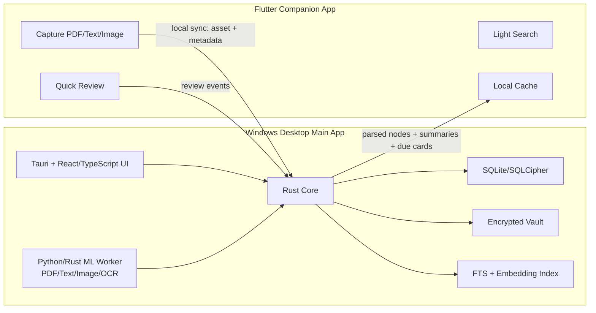
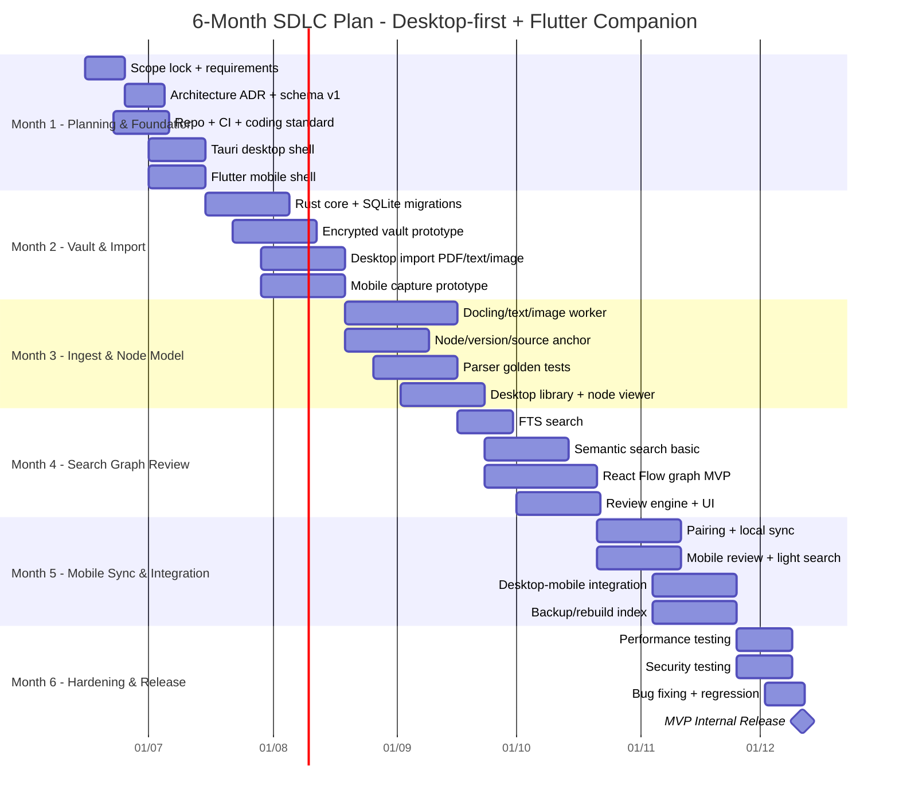
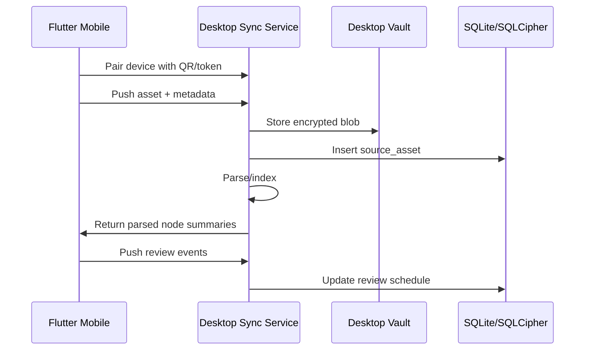
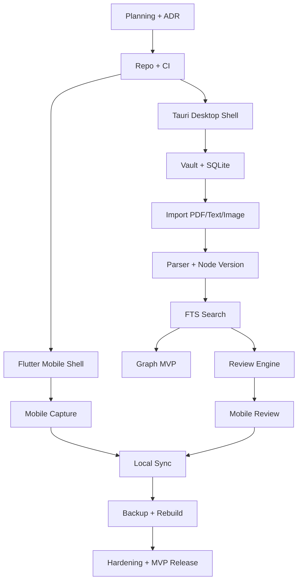

# SDLC Implementation Plan — Desktop-first Local Knowledge App + Flutter Mobile Companion

## Approved execution addendum — 2026-06-30

The canonical product name is **StudyNote**. The immediate execution order
below supersedes older feature ordering where it conflicts, while the
six-month release constraints remain in force.

| Order | Slice | Current gate |
|---:|---|---|
| 1 | Real Project container, Markdown Note persistence, safe legacy migration | Core and Tauri command seam implemented; UI cutover pending |
| 2 | StudyNote brand, project gating, `Note → Review → Graph`, Note tags, responsive shell | Pending |
| 3 | Project-owned immutable Source Versions and typed Evidence detail drawer | Pending |
| 4 | Project-level Graph/Review, Note filters, transparent learning metrics | Pending |
| 5 | Full PET MVP using deterministic state plus user-confirmed action cards/paid AI | Pending |

### Locked product decisions

- Before a Project is selected, `Note`, `Review`, `Graph`, Add Sources, and
  Generate Nodes remain visible but disabled.
- Opening a Project enters Note and every new Project creates one blank Note.
- Graph defaults to Note-level and Project scope; Concept expansion and Note
  filtering are optional views.
- A Source belongs to one Project. Imports are managed snapshots; updates
  create immutable Source Versions.
- AI relations require Evidence before approval. Manual relations require a
  user rationale and are marked manual.
- Review Runs are immutable Markdown. Learning metrics derive from append-only,
  non-sensitive domain events and expose their thresholds.
- PET is one vault-level companion, uses Project context, never mutates
  canonical data autonomously, and invokes paid AI only after explicit action.
- React/Tauri is adaptive for laptop/tablet with a functional 360px fallback;
  Flutter remains the official mobile companion.

### Slice 1 cutover gate

Do not invoke legacy migration automatically until React stops calling legacy
`save_note`/`list_notes`. Slice 2 must run migration before first Project list,
switch all Note writes to Project commands, verify the migrated Project, then
retire the legacy UI path without deleting the legacy SQLite table.

## 0. Context & Final Direction

This plan is based on the agreed constraints:

| Item | Decision |
|---|---|
| Team | 2 Testers, 2 Frontend, 2 Backend, 1 DevOps |
| MVP duration | 6 months |
| Desktop priority | Windows first |
| Mobile stack | Flutter |
| MVP media scope | PDF / text / image only |
| Product direction | Desktop-first local knowledge workstation + mobile companion |

Final architecture direction:

> **Windows desktop is the main product and source of truth. Flutter mobile is a companion app for capture, quick review, and lightweight search.**

This avoids over-scoping the MVP while still keeping the product useful in real study/research workflows.

---

## 1. MVP Scope

### 1.1 MVP Includes

| Module | Desktop Windows | Mobile Flutter |
|---|---|---|
| Local vault | Yes | No canonical vault |
| Import PDF/text/image | Yes | Yes, then sync to desktop |
| Parse PDF/text/image | Yes | No |
| Basic image OCR | Yes | No, or preview only |
| Node graph | Yes | Viewer only |
| Search | FTS + basic semantic search | Lightweight local cache search |
| Review | Yes | Yes |
| Sync | Local desktop ↔ mobile sync | Yes |
| Encryption | Yes | Lightweight cache + secure storage |
| Audio/video | No | No |
| Collaboration | No | No |
| Cloud AI by default | No | No |

### 1.2 MVP Excludes

| Excluded Feature | Reason |
|---|---|
| Audio/video ingest | Too risky for 6-month MVP |
| Full graph editor on mobile | Poor UX and high performance risk |
| Full-system CRDT | Too complex too early |
| Firecracker/gVisor sandbox | Not required for PDF/text/image MVP |
| Central cloud backend | Conflicts with local-first MVP |
| Multi-user collaboration | Not aligned with personal learning MVP |

---

## 2. High-level Architecture



### 2.1 Key Architectural Decisions

| Decision | Final Choice |
|---|---|
| Desktop app | Tauri + React/TypeScript |
| Core system | Rust |
| Mobile app | Flutter |
| Local database | SQLite/SQLCipher |
| Vault | Encrypted file vault + manifest/event log |
| Parser worker | Docling/OCR worker |
| Graph UI | React Flow for MVP |
| Search | SQLite FTS first, semantic search second |
| Review scheduler | FSRS basic |
| Sync model | Desktop canonical + mobile companion |
| Audio/video | Not in MVP |

---

## 3. Team Allocation

| Role | Count | Main Responsibility |
|---|---:|---|
| Frontend | 2 | Desktop UI + Mobile Flutter |
| Backend | 2 | Rust core/storage/sync + parser/index/review |
| Tester | 2 | Manual QA + automation/performance/security |
| DevOps | 1 | CI/CD, Windows packaging, release, build infra |

### 3.1 Suggested Role Mapping

| Member | Suggested Role | Workstream |
|---|---|---|
| FE-1 | Desktop Frontend Lead | Tauri React UI, graph editor, search, review UI |
| FE-2 | Mobile Flutter Lead | Capture, inbox, review, sync client |
| BE-1 | Core Backend Lead | Rust core, vault, SQLite/SQLCipher, API commands |
| BE-2 | Ingest/Search Lead | Docling worker, OCR, node segmentation, FTS/embedding |
| QA-1 | Functional QA | Test cases, regression, user flows |
| QA-2 | Automation/Performance QA | Parser tests, benchmark, sync chaos tests |
| DevOps | Release/Infra Lead | GitHub Actions, installer, signing, build scripts, artifact management |

---

## 4. Six-month SDLC Timeline

Assumed start date: **2026-06-15**
Target MVP internal release: **2026-12-11**



---

## 5. Sprint Plan — 12 Sprints, 2 Weeks Each

### Sprint 0 — Planning Lock

| Owner | Task | Deliverable |
|---|---|---|
| All | Lock MVP/non-goals | Product Scope v1 |
| BE-1 | ADR storage/sync/core | ADR-001 to ADR-005 |
| FE-1 | Desktop UX flow | Desktop wireframe |
| FE-2 | Mobile UX flow | Mobile wireframe |
| QA | Test strategy | Test Plan v1 |
| DevOps | Repo/branch/release strategy | Engineering Setup Doc |

**Gate:** Do not start large feature implementation before this sprint passes.

---

### Sprint 1 — Project Foundation

| Owner | Task | Deliverable |
|---|---|---|
| DevOps | Monorepo + CI | Build pipeline |
| FE-1 | Tauri React shell | Desktop app opens |
| FE-2 | Flutter shell | Mobile app opens |
| BE-1 | Rust core skeleton | Core crate |
| BE-2 | Worker skeleton | Parser worker app |
| QA | Smoke test checklist | Test cases v1 |

---

### Sprint 2 — Vault + SQLite

| Owner | Task | Deliverable |
|---|---|---|
| BE-1 | SQLite schema migration | `source_asset`, `node`, `node_version` |
| BE-1 | Vault create/open | Local vault works |
| BE-1 | Asset hashing | SHA-256 asset ID |
| FE-1 | Vault setup screen | Create/open vault UI |
| QA | Storage test cases | Vault regression suite |
| DevOps | Windows dev build | Internal installer alpha |

---

### Sprint 3 — Import PDF/Text/Image

| Owner | Task | Deliverable |
|---|---|---|
| BE-1 | Import command | File copied to vault |
| BE-2 | MIME detection | PDF/text/image classification |
| FE-1 | Import UI + queue | Import screen |
| FE-2 | Mobile capture UI | Pick image/file |
| QA | Import edge cases | Duplicate/corrupt/large file tests |

---

### Sprint 4 — Parser Baseline

| Owner | Task | Deliverable |
|---|---|---|
| BE-2 | Text parser | `.txt`, `.md` parsed |
| BE-2 | PDF parser via Docling | PDF structured output |
| BE-2 | Image OCR baseline | Image to text |
| BE-1 | Save parsed result | Node versions |
| FE-1 | Library screen | Asset list/status |
| QA-2 | Golden parser fixtures | Expected parser outputs |

---

### Sprint 5 — Node Model + Source Anchor

| Owner | Task | Deliverable |
|---|---|---|
| BE-1 | Node/version API | CRUD node read model |
| BE-2 | Segmentation v1 | Heading/page/paragraph split |
| FE-1 | Node detail screen | Title/body/source |
| QA | Traceability tests | Node to source file/page |
| DevOps | Test data bundle | Fixtures packaged |

**Acceptance:** Every node must trace back to its source file/page/range.

---

### Sprint 6 — FTS Search

| Owner | Task | Deliverable |
|---|---|---|
| BE-1 | SQLite FTS5 index | Full-text search |
| BE-1 | Search API | Query/filter/limit |
| FE-1 | Desktop search UI | Search result list |
| FE-2 | Mobile light search mock | Cache search UI |
| QA | Search test cases | Keyword, tag, empty result |

---

### Sprint 7 — Semantic Search Basic

| Owner | Task | Deliverable |
|---|---|---|
| BE-2 | Embedding worker | Node embedding |
| BE-1 | Vector storage simple | SQLite BLOB or local vector table |
| BE-1/BE-2 | Hybrid ranking v1 | Lexical + semantic |
| FE-1 | Search result scoring UI | Better result display |
| QA-2 | Search benchmark | Recall@k sample test |

**Rule:** Do not over-engineer. SQLite first. Do not add Qdrant/Weaviate in MVP unless SQLite clearly fails.

---

### Sprint 8 — Graph MVP

| Owner | Task | Deliverable |
|---|---|---|
| BE-1 | Edge schema/API | Create/read edge |
| BE-2 | Auto-link simple | Similarity + same source |
| FE-1 | React Flow graph view | Node/edge canvas |
| FE-1 | Manual edge edit | Edit relation |
| QA | Graph UX tests | Render/edit/filter |

---

### Sprint 9 — Review Engine

| Owner | Task | Deliverable |
|---|---|---|
| BE-1 | Review tables | `review_item`, `review_event` |
| BE-2 | Review item generation | Node to question |
| BE-1 | FSRS scheduling basic | Due date |
| FE-1 | Desktop review UI | Review queue |
| FE-2 | Mobile review UI | Quick review |
| QA | Review flow test | Due/grade/history |

---

### Sprint 10 — Desktop-Mobile Sync

| Owner | Task | Deliverable |
|---|---|---|
| BE-1 | Local sync server | Desktop sync endpoint |
| FE-2 | Flutter sync client | Push/pull |
| BE-1 | Pairing token/QR | Device pairing |
| FE-1 | Desktop sync status | Device list/status |
| QA-2 | Sync chaos tests | Offline/retry/duplicate |

#### Sync Sequence



---

### Sprint 11 — Backup, Recovery, Hardening

| Owner | Task | Deliverable |
|---|---|---|
| BE-1 | Rebuild index | Rebuild from vault |
| BE-1 | Backup/export | Vault backup |
| DevOps | Windows package | Installer/release artifact |
| QA-1 | Regression suite | Release candidate test |
| QA-2 | Performance test | 100 PDFs/images |
| FE-1/FE-2 | UX polish | Error/loading/empty states |

---

### Sprint 12 — MVP Release

| Owner | Task | Deliverable |
|---|---|---|
| All | Bug fixing | RC stabilization |
| QA | Final regression | Test report |
| DevOps | Release build | MVP installer |
| BE/FE | Documentation | User guide/dev guide |
| All | Demo script | MVP demo |

---

## 6. MoSCoW Backlog

### Must-have

| ID | Feature | Owner |
|---|---|---|
| M01 | Create/open encrypted local vault | BE-1 |
| M02 | Import PDF/text/image on desktop | BE-1/FE-1 |
| M03 | Store raw asset with hash | BE-1 |
| M04 | SQLite schema + migration | BE-1 |
| M05 | Parse text/PDF/image basic | BE-2 |
| M06 | Generate node versions | BE-1/BE-2 |
| M07 | Source anchor | BE-1 |
| M08 | Search FTS | BE-1/FE-1 |
| M09 | Node detail UI | FE-1 |
| M10 | Graph view basic | FE-1 |
| M11 | Review queue | BE-1/FE-1 |
| M12 | Flutter capture | FE-2 |
| M13 | Mobile review | FE-2 |
| M14 | Local sync desktop-mobile | BE-1/FE-2 |
| M15 | Backup/rebuild index | BE-1 |
| M16 | Windows installer | DevOps |

### Should-have

| ID | Feature | Owner |
|---|---|---|
| S01 | Semantic search basic | BE-2 |
| S02 | Image OCR quality improvement | BE-2 |
| S03 | Manual node edit | FE-1/BE-1 |
| S04 | Manual edge edit | FE-1/BE-1 |
| S05 | Mobile light search | FE-2 |
| S06 | Tag/filter system | FE-1/BE-1 |
| S07 | Parser quality dashboard | QA-2/BE-2 |

### Could-have

| ID | Feature | Owner |
|---|---|---|
| C01 | Sigma.js large graph explorer | FE-1 |
| C02 | Better semantic chunking | BE-2 |
| C03 | Export Markdown | BE-1 |
| C04 | Theme/customization | FE-1 |
| C05 | Local LLM summary | BE-2 |

### Won’t-have in MVP

| ID | Feature |
|---|---|
| W01 | Audio/video |
| W02 | Multi-user collaboration |
| W03 | Cloud sync |
| W04 | Full CRDT |
| W05 | Full mobile graph editor |
| W06 | Firecracker/gVisor sandbox |
| W07 | Plugin marketplace |

---

## 7. Release Gates

### Gate 1 — Planning Gate

| Criteria | Required Status |
|---|---|
| MVP scope | Locked |
| Non-goals | Locked |
| Architecture ADR | Approved |
| Data schema v1 | Approved |
| Sync contract v0 | Approved |
| Test strategy | Approved |
| Risk register | Approved |

---

### Gate 2 — Technical Feasibility Gate

| Criteria | Required Status |
|---|---|
| Tauri Windows shell | Running |
| Flutter shell | Running |
| Rust core bridge | Working |
| SQLite migration | Working |
| Import file | Working |
| Parser baseline | Working on 10 test files |
| CI build | Passing |

---

### Gate 3 — Alpha Gate

| Criteria | Target |
|---|---|
| Import | 50 PDF/text/image files without crash |
| Search | Keyword search returns correct source |
| Node viewer | Source anchor visible |
| Graph | 200 nodes usable |
| Review | Due queue working |
| Mobile capture | Sends file to desktop |
| Backup | Index rebuild works |

---

### Gate 4 — MVP Release Gate

| Criteria | Target |
|---|---|
| Windows install | Clean install passes |
| Regression | 0 critical/high bugs |
| Search latency | 10k nodes lexical search < 300–500ms |
| App startup | < 3s on normal developer machine |
| Parser failure handling | No crash, clear error state |
| Sync retry | Offline/reconnect passes |
| Security | No plaintext DB/vault content |
| Docs | Setup guide + user guide ready |

---

## 8. RACI Matrix

| Workstream | FE-1 Desktop | FE-2 Mobile | BE-1 Core | BE-2 Ingest | QA-1 | QA-2 | DevOps |
|---|---|---|---|---|---|---|---|
| Requirements | C | C | A | C | R | R | C |
| Desktop UI | A/R | I | C | I | C | C | I |
| Flutter mobile | I | A/R | C | I | C | C | I |
| Vault/storage | I | I | A/R | C | C | R | C |
| Parser/OCR | I | I | C | A/R | C | R | C |
| Search | R | C | A/R | R | C | R | I |
| Graph | A/R | I | R | C | C | R | I |
| Review | R | R | A/R | C | C | R | I |
| Sync | C | R | A/R | I | C | R | C |
| Security | C | C | A/R | C | R | R | C |
| Release | C | C | C | C | C | R | A/R |

Legend:

- **A** = Accountable
- **R** = Responsible
- **C** = Consulted
- **I** = Informed

---

## 9. Repository Structure

```txt
local-knowledge-app/
  apps/
    desktop/
      src/                  # React/TypeScript
      src-tauri/             # Tauri app
    mobile_flutter/
      lib/
      android/
      ios/
  crates/
    core/
      src/
        vault/
        storage/
        graph/
        search/
        review/
        sync/
        crypto/
    tauri_commands/
  workers/
    document_worker/
      src/
      requirements.txt
      pyproject.toml
  docs/
    adr/
    architecture/
    api-contract/
    schema/
    test-plan/
    release/
  tests/
    fixtures/
      pdf/
      text/
      images/
    golden/
    integration/
  scripts/
    dev/
    build/
    benchmark/
```

---

## 10. Desktop-Mobile Sync API Contract

### 10.1 Asset Push from Flutter to Desktop

```json
{
  "requestId": "uuid",
  "deviceId": "mobile-device-id",
  "asset": {
    "localId": "mobile-local-id",
    "sha256": "hash",
    "filename": "lecture-slide.pdf",
    "mimeType": "application/pdf",
    "modality": "pdf",
    "sizeBytes": 1234567,
    "createdAt": "2026-07-01T10:00:00Z",
    "tags": ["database", "week-3"]
  }
}
```

### 10.2 Desktop Response After Parse

```json
{
  "assetId": "asset_uuid",
  "status": "indexed",
  "nodes": [
    {
      "nodeId": "node_uuid",
      "versionId": "version_uuid",
      "title": "Database Normalization",
      "summary": "Explains 1NF, 2NF, and 3NF.",
      "sourceRange": {
        "page": 3,
        "startOffset": 120,
        "endOffset": 890
      },
      "tags": ["database", "normalization"]
    }
  ]
}
```

### 10.3 Review Event from Mobile

```json
{
  "reviewItemId": "review_uuid",
  "grade": 3,
  "latencyMs": 8200,
  "reviewedAt": "2026-08-01T12:00:00Z",
  "deviceId": "mobile-device-id"
}
```

---

## 11. Risk Register

| Risk | Impact | Probability | Mitigation |
|---|---:|---:|---|
| Flutter mobile becomes too large in scope | High | High | Limit mobile to capture/review/search |
| Team is not familiar with Rust core | High | Medium | Sprint 1 technical spike + pairing |
| PDF parsing quality is unstable | High | High | Golden dataset + manual correction UI |
| Vietnamese OCR quality is weak | Medium | High | Benchmark early and support fallback OCR |
| Sync causes data loss | High | Medium | Append-only event log + backup |
| Graph UI becomes messy | Medium | Medium | MVP supports only small graph view |
| Semantic search is too heavy | Medium | Medium | FTS is mandatory baseline |
| Windows packaging issues | Medium | Medium | DevOps starts packaging from Sprint 2 |
| Encryption makes debugging harder | Medium | Medium | Dev mode vault for non-sensitive data |
| Testers join too late | High | Medium | QA writes tests from Sprint 0 |

---

## 12. Implementation Order



---

## 13. Definition of Done

A task is only done when:

| Area | Requirement |
|---|---|
| Code | Build passes and lint passes |
| Test | Related unit/integration tests pass |
| UX | Empty/loading/error states exist |
| Security | No secrets or sensitive vault content logged |
| Data | Migration/recovery does not break old data |
| Docs | ADR/API/schema updated when changed |
| Review | At least one teammate reviews code |
| Demo | Major feature has screenshot/video or demo notes |

---

## 14. Test Plan

| Test Type | Scope |
|---|---|
| Unit test | Vault, hashing, encryption, schema, review scheduler |
| Integration test | Import → parse → node → search |
| Golden parser test | PDF/image/text expected output |
| Sync test | Offline, retry, duplicate asset, missing blob |
| Security test | Wrong key, corrupted DB, denied file access |
| Performance test | 100 files, 10k nodes, search latency |
| UX test | Import fail, parser fail, empty vault, no search result |

### 14.1 Benchmark Targets

| Metric | MVP Target |
|---|---:|
| App cold start | < 3s |
| Lexical search with 10k nodes | < 300–500ms |
| Open node detail | < 200ms |
| Import small text file | < 1s |
| Parse 50-page PDF | Background job, no UI freeze |
| Small graph view | 200–500 nodes usable |
| Crash-free alpha session | > 95% internal testing |

---

## 15. Final Reviewer Notes

This plan is viable for a 7-person team over 6 months **only if scope is controlled**.

Hard rules:

1. **Windows desktop is the source of truth.**
2. **Flutter mobile is a companion, not the main app.**
3. **PDF/text/image only for MVP.**
4. **FTS search must work before semantic search.**
5. **Do not add audio/video during MVP.**
6. **Do not add full CRDT, collaboration, or cloud sync during MVP.**
7. **Parser quality and source traceability are more important than flashy AI features.**

Final implementation version:

> **6-month MVP: Windows desktop local-first app with Tauri + React + Rust core + SQLite/SQLCipher + Docling/OCR worker, plus Flutter mobile companion for capture, review, and lightweight search.**
