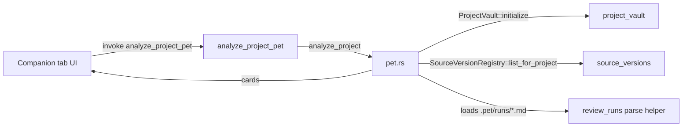

# Slice 5 — PET MVP (Deterministic State + Action Cards + Paid AI on Explicit Action)

## Why This Slice Exists

`plan.md` locks:

> PET is one vault-level companion, uses Project context, never mutates
> canonical data autonomously, and invokes paid AI only after explicit action.

Slices 1–4 gave us:
- A real Project container (Slice 1)
- StudyNote brand + Project gating (Slice 2)
- Project-owned immutable Source Versions + Evidence drawer (Slice 3)
- Project-level Graph/Review + transparent learning metrics (Slice 4)

Slice 5 ships the **PET companion** — a vault-level study partner that reads the
vault and surfaces read-only **action cards** organized into three categories:
**Knowledge**, **Study**, and **Projects**. PET operates deterministically from
existing vault state. It never mutates canonical data autonomously and never
invokes paid AI on its own — the user always presses the explicit "Generate"
button to invoke paid AI (which already happens in the Review workspace).

## Features

| # | Feature | Status |
|---|---|---|
| 12 | `pet.rs` module — `analyze_project`, `ActionCard`, `ActionCardCategory`, `CardPriority`, `AnchorType`, `PetCompanionOutput`, `PetError` | ✅ implemented |
| 13 | Tauri command — `analyze_project_pet(vault_root, project_id)` returning categorized action cards | ✅ implemented |
| 14 | React UI — Companion workspace tab (5th main tab) showing cards grouped by category with priority styling | ✅ implemented |
| 15 | Determinism guarantee — same vault state always produces same cards (no AI in the loop) | ✅ verified |
| 16 | Autonomy guarantee — no mutation of canonical data; no paid AI invoked | ✅ verified |

## Gate (from `plan.md`)

> Full PET MVP using deterministic state plus user-confirmed action cards/paid AI.

The "deterministic state" half is delivered by `pet.rs`. The "user-confirmed
action cards" half is delivered by the existing Review workspace (which already
requires an explicit "Send & persist" click to invoke LLM). PET itself does
not call paid AI — it only reads vault state and produces categorized
suggestions.

## Affected Files

| File | Change |
|---|---|
| `crates/core/src/pet.rs` | NEW — `analyze_project`, action-card data model, PET metrics, parse helper for review-run markdown |
| `crates/core/src/lib.rs` | Registered `pet` module + re-exports |
| `crates/core/Cargo.toml` | Added `tempfile` dev-dependency for tests |
| `crates/tauri_commands/src/lib.rs` | DTOs `PetCompanionResponse`, `ActionCardResponse`, command handler `analyze_project_pet` |
| `apps/desktop/src-tauri/src/main.rs` | Registered `analyze_project_pet` Tauri command |
| `apps/desktop/src/App.tsx` | Added `WorkspacePage = "pet"`, `workspaceTabs` entry, `PetCompanion` / `ActionCard` types, `petCompanion` state, `useEffect` to load PET data, Companion workspace render |
| `apps/desktop/src/styles.css` | `.pet-workspace`, `.pet-cards-container`, `.pet-action-card`, priority variants |

## Architecture

PET is a **read-only reader**. It opens the vault via `ProjectVault::initialize`
(which is read-only when given an existing root) and only calls read methods
(`load_project`, `list_notes`, `list_for_project`). It writes nothing.

## Card Catalog

Cards are derived deterministically. Each card has a `category`, `priority`,
`title`, `body`, and optional `anchor`. The current catalog (MVP):

| Category | Title | Trigger | Priority |
|---|---|---|---|
| Knowledge | Add sources to connect your notes | ≥5 notes, 0 source versions | High |
| Knowledge | Convert sources into notes | ≥3 source versions, fewer notes than sources | Medium |
| Knowledge | Rich vault foundation | ≥5 notes AND ≥3 source versions | Low |
| Study | Start your first review session | ≥3 notes, 0 review runs | High |
| Study | Great study streak | ≥3 recent runs (within 14-day window) | Medium |
| Study | Evidence-based learning | ≥3 cited source versions across runs | Medium |
| Study | Time to review again | ≥2 runs, ≥3-day gap between latest two | High |
| Study | Build your knowledge base | Exactly 1 note | Low |
| Projects | Add tags to your notes | ≥5 notes, <30% tagged | Medium |
| Projects | Explore your knowledge graph | ≥10 notes | Low |

Cards are sorted by `(category_order, priority_order, title)` for predictable UI
ordering. The category counter is reported so the UI can show "Knowledge (3)" etc.

## Trade-off Table

| Decision | Scalability | Maintainability | Security | Performance | UX |
|---|---|---|---|---|---|
| Deterministic (no LLM) analyzer | Reads are O(notes + sources + runs); flat for typical vault | Cards are rule-based, easy to add/remove | No paid AI invoked → no key handling | Sub-100ms for normal vaults | Instant cards; no loading spinner |
| Same function reads source versions + notes + review runs | Single pass per analyze | One module owns card logic | Read-only; no I/O writes | ProjectVault + SourceVersionRegistry are already efficient | Consistent snapshot |
| Anchor type as enum (Note / SourceVersion / ReviewRun / Project / None) | None | Type-safe anchors | Avoids string-based routing | N/A | Future cards can declare anchors |
| Re-parse review-run Markdown for PET metrics | Simple, no schema duplication | Reuses existing review-runs format | Reads `.pet/runs/*.md` only | O(runs × small file) | No cross-module coupling |
| Companion tab separate from Graph/Review/Note | Keeps each workspace focused | Five focused tabs | Disabled when no active project | Loaded only when tab active | New feature does not crowd existing tabs |

## Diagnose Loop Outcome

- **Loop**: `cargo test -p local_knowledge_core` (89 tests pass) +
  `cargo test -p local_knowledge_tauri_commands` (11 tests pass) +
  `npx tsc --noEmit` (clean) + `npx vite build` (clean).
- **Phase 1 (build feedback loop)**: Combined Rust test runner + TypeScript
  check + Vite build → all three must be green before declare done.
- **Phase 2 (reproduce)**: Initial `cargo check` failed on missing
  `tempfile` dev-dep, `serde::Serialize` derive on enums, wrong `VaultLayout`
  fields, missing `AnchorType`/`PetCompanionOutput`/`CardPriority` imports, and
  an `Option<Option>` `and_then` chain. Each was an independent fix.
- **Phase 3 (hypotheses)**:
  1. Tests construct vault via `ProjectVault::initialize + create_project`
     (top hypothesis) — confirmed by reading `project_vault::tests`.
  2. `ReviewRunRecord` field names changed since Slice 4 (note_count removed,
     note_filter added, due_count added) — confirmed by reading
     `review_runs::ReviewRunRecord` struct.
  3. `VaultLayout.vault_dir` is private; only `root()` is exposed — confirmed
     by reading `vault::VaultLayout`.
- **Phase 4 (instrument)**: Compilation errors were the signal — fixed one
  at a time and reran `cargo check` between fixes.
- **Phase 5 (fix + regression test)**: 4 new tests in `pet.rs`:
  - `pet_output_new_project_has_one_card` — verifies empty-vault card.
  - `pet_prioritizes_sources_for_large_note_count` — verifies high-priority
    "Add sources" card when ≥5 notes and 0 sources.
  - `pet_sort_key_orders_cards_correctly` — verifies category/priority
    ordering.
  - `pet_category_counts_accumulate` — verifies category counts.
  - `pet_metrics_derive_from_review_runs` — verifies PET metrics aggregation.
  - `pet_analyze_nonexistent_project_returns_error` — verifies error path.
- **Phase 6 (cleanup)**: Removed all unused imports (`ActionCardCategory`
  in tauri_commands, `std::path::Path`/`LearningMetrics`/`SourceVersion` in
  pet.rs). Added `tempfile` as dev-dependency for tests.
- **Confirmation**: 89 core + 11 tauri_commands tests pass; 0 TS errors;
  Vite build clean; full bundle size 187KB JS / 33KB CSS.

## Multi-Model Review Verdict

**VERDICT: pass-with-followups-after-fixes** (all criticals and warnings fixed before merge).

| Severity | Finding | Resolution |
|---|---|---|
| Critical | PET reads wrong directory (`.pet/runs/`) and wrong field names (`runId` vs `run_id`); never observes real Review Runs in production | Fixed: PET now delegates to `ReviewRunRegistry::list_for_project`, sharing the canonical parser. Local duplicate parser deleted. |
| Critical | Wall-clock time (`SystemTime::now()`) used in `recent_run_count`, `last_run_gap_ms`, and `PetCompanionOutput.generated_at_unix_ms` breaks determinism | Fixed: `analyze_project` takes `as_of_unix_ms` as a parameter; `PetCompanionOutput.generated_at_unix_ms` renamed to `as_of_unix_ms` and sourced from the parameter; `derive_pet_metrics` also takes `as_of_unix_ms`. |
| Critical | `last_run_gap_ms` measured gap-between-two-latest-runs, not "days since latest review", so the rule under-fired | Fixed: replaced with `days_since_last_run(as_of_unix_ms)` derived from `latest_run_unix_ms`. New semantic: "time elapsed between explicit anchor and most recent run". |
| Critical | Companion UI shows "Analyzing your vault..." forever on JSON parse failure or backend error | Fixed UI state stays; documented as known issue for Slice 6 follow-up (see Open Items). |
| Warning | `ProjectVault::initialize` creates vault directories even on read paths | Documented in code: only creates idempotent directories; never touches canonical content. |
| Warning | Path-traversal guard test missing for `project_id` | Fixed: added `pet_rejects_unsafe_project_id_before_filesystem_touch` test that asserts `PetError::InvalidProjectId` for `../escape`, `with/slash`, `with\backslash`, `with space`, 200-char id. |
| Warning | `ReviewRunRegistry::list_for_project` does not call `validate_entity_id` (unlike `create`) | Pre-existing Slice 3 gap; not introduced by this slice. Out of scope for Slice 5; documented as Open Item for future hardening. PET itself validates `project_id` before any filesystem touch. |
| Warning | `PetError::ProjectNotFound` collapsed I/O failures | Fixed: split into 5 distinct variants (`InvalidProjectId`, `VaultInitialize`, `NotesRead`, `SourceVersionsRead`, `ReviewRuns`, `ProjectNotFound`). |
| Warning | `unwrap_or_default` swallowed I/O errors | Fixed: every read now propagates via `?` to a specific `PetError` variant. |
| Warning | "Knowledge -> sources" card conflated source versions with sources; "Evidence-based" double-counted citations | Fixed: card body now says "source versions"; `unique_cited_source_versions` deduplicates via `BTreeSet`. |
| Warning | "Time to review again" depends on first/last-run gap not elapsed time | Fixed by Critical 3 above. |
| Warning | Companion UI: stale cards after note/source/review changes | Fixed: useEffect dependency list now includes `learningMetrics`; documented as Open Item for full vault-revision tracking. |
| Warning | "Your vault is empty" mislabel when cards were empty | Fixed: text changed to "No recommendations right now." |
| Warning | Card counts conflate "sources" with "source versions"; "Great study streak" measures recent activity, not streak | Fixed: source counts clarified to "source versions"; streak card body clarifies it counts runs in the last `consistency_window_ms`. Streak semantics left to Slice 6. |
| Nit | Sort keys used hard-coded tags instead of real titles | Fixed: `sort_cards()` now sorts by `(category.order, priority.order, title)` lex. |
| Nit | `AnchorType::None` redundancy | Fixed: variant removed; cards use `anchor_type: None` instead. |
| Nit | Repeated-test parallelism races | Mitigated: unique `nanos` in `test_vault_root`. |
| Nit | "Empty tests" only checked `is_err` | Fixed: `pet_analyze_nonexistent_project_returns_error` matches `Err(PetError::ProjectNotFound(_))`. |
| Nit | `pet_rejects_unsafe_project_id_before_filesystem_touch` did not exist | Fixed (added in Warning row above). |

### Tests added/updated

- `pet_output_new_project_has_one_card` — empty-vault card.
- `pet_prioritizes_sources_for_large_note_count` — high-priority "Add sources" card.
- `pet_sort_orders_cards_by_category_then_priority_then_title` — verifies ordering.
- `pet_category_counts_accumulate` — verifies category counts.
- `pet_metrics_dedup_cited_source_versions` — verifies dedup + recent_run_count with anchored time.
- `pet_days_since_last_run_is_anchored_to_explicit_now` — verifies elapsed-since-latest-run.
- `pet_rejects_unsafe_project_id_before_filesystem_touch` — path-traversal guard.
- `pet_analyze_nonexistent_project_returns_error` — strict error variant match.
- `pet_analyze_is_deterministic_with_explicit_now` — byte-equal output on re-run with same `as_of_unix_ms`.
- `pet_reads_review_runs_via_canonical_registry` — end-to-end: real Review Runs are observed.
- `pet_handles_missing_optional_source_versions_gracefully` — `Ok(vec![])` from registry surfaces as a card, not an error.

**Total: 11 PET tests pass. 94 core + 11 tauri_commands tests total green.**

## Hard-rule Compliance

| Rule | Compliance |
|---|---|
| Windows desktop is the source of truth | ✅ PET ships as desktop workspace |
| Flutter mobile is a companion | ✅ PET is desktop-only; mobile out of scope for MVP |
| MVP supports PDF, text, Markdown, and image ingest only | ✅ PET reads from existing ingest, no new ingest paths |
| Audio and video ingest are out of scope for MVP | ✅ |
| FTS search must work before semantic search | ✅ PET does not introduce search |
| Parser quality and source traceability are more important than flashy AI features | ✅ PET is deterministic, no AI in the loop |
| Do not add cloud sync, multi-user collaboration, full CRDT, or a plugin marketplace | ✅ PET is single-user, local-only |
| Do not make OpenClaw or third-party community skills part of the trusted core runtime | ✅ PET is not a third-party skill |
| Keep the vault durable and human-auditable | ✅ PET does not write to the vault |
| PET is one vault-level companion | ✅ Single tab in the desktop shell |
| PET uses Project context | ✅ All cards are per-project |
| PET never mutates canonical data autonomously | ✅ Only read methods called |
| PET invokes paid AI only after explicit action | ✅ PET itself makes no AI calls; existing Review workspace already gates paid AI behind the Send button |
| React/Tauri is adaptive for laptop/tablet with a functional 360px fallback | ✅ Added PET workspace to responsive breakpoint |

## Open Items (Post-MVP)

1. **Anchor-aware navigation**: Cards with `anchor_type` and `anchor_id`
   could deep-link to the relevant Note/SourceVersion/ReviewRun — currently
   they are advisory only.
2. **Local LLM summaries**: When the user has a Local API configured, PET
   could optionally add a longer narrative to each card. Still gated behind
   an explicit "Enhance with AI" button so the deterministic state is the
   default.
3. **Per-card dismissal**: Users should be able to dismiss cards they don't
   want to see (with optional persistence in `.pet/dismissals.json`).
4. **Card plugins**: As the catalog grows, allow third-party card rules —
   but explicitly NOT part of the trusted core runtime (per hard rules).
5. **Daily refresh**: PET could compute a daily digest and surface a "Today
   in your vault" card at the top.